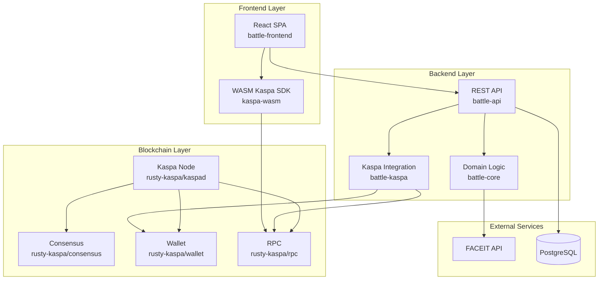

# KaspaBattle

[](https://kaspa.org)
[](https://www.rust-lang.org)
[](https://reactjs.org)

KaspaBattle is a decentralized P2P esports wagering platform built on the **Kaspa blockchain**. With our **v1.0 Lobby System**, players can seamlessly create or join challenges, connect their Kaspa wallets, and automatically transition into FACEIT matches to wager KAS in a non-custodial, trustless environment.

By leveraging Kaspa's high-throughput DAG architecture and real-time settlement, KaspaBattle provides a seamless, secure, and instant competitive gaming experience.

## Key Features

- **Full Lobby System (v1.0)**: Live overview of open challenges, easy creation of new matches (BO1-BO3), and seamless joining mechanics.
- **P2P Esports Wagers**: Challenge other players and wager KAS on match outcomes.
- **Non-Custodial Escrow**: Funds are held in per-match escrow addresses via the Kasplex MatchEscrow contract.
- **Automated FACEIT Integration**: Automatic match creation on FACEIT once both players have funded the escrow.
- **Oracle-Based Verification**: Automatic match resolution via authorized Oracles fetching results from FACEIT.
- **Fast Settlements**: Instant payout as soon as the DAG confirms the Oracle resolve transaction.
- **Secure Architecture**: PKCE for OAuth, comprehensive error handling, and multi-layer security protections.
- **Modern UI**: Clean React/TypeScript frontend (Tailwind + shadcn) with integrated Kaspa WASM wallet support.

## Architecture

KaspaBattle follows a layered architecture with three main components:

### High-Level Architecture



- **Frontend Layer**: React SPA with Kaspa WASM integration for wallet and RPC
- **Backend Layer**: Rust services for API, authentication, match management, and Kaspa operations
- **Blockchain Layer**: Kaspa node providing consensus, wallet, and RPC services
- **External Services**: FACEIT for player/match data, PostgreSQL for state

## Project Structure

- `kaspabattle/`: Rust workspace containing the backend services.
  - `battle-api/`: Axum REST API server.
  - `battle-kaspa/`: Kaspa blockchain integration.
  - `battle-core/`: Shared domain logic and models.
- `battle-frontend/`: React + Vite frontend application.
- `rusty-kaspa/`: Full Kaspa node implementation.
- `docs/`: Comprehensive project documentation.

## Getting Started

### Prerequisites

- **Docker**: Docker Desktop or Docker Engine must be installed and **running**.
- **Rust**: 1.75 or newer.
- **Node.js**: 18.x or newer.
- **Kaspa Node**: Access to a `kaspad` node (Mainnet or Testnet-10) with `--utxoindex`.

### Setup

The easiest way to run KaspaBattle locally is using **Docker**. Ensure Docker Desktop or Docker Engine is running on your machine.

1. **Clone the repository**:

   ```bash
   git clone https://github.com/TimBee706/KaspaBattle2.git
   cd KaspaBattle2
   ```

2. **Start all services with Docker (Recommended)**:

   ```bash
   docker-compose up -d
   ```

   - **Frontend**: Available at `http://localhost:3000`
   - **Backend API**: Available at `http://localhost:8080`
   - **Database**: PostgreSQL runs on port `5432`

---

#### Alternative: Manual Local Development

If you prefer running the app locally for development (you still need a PostgreSQL Database):

1. **Start the Database** (via Docker):

   ```bash
   docker-compose up -d postgres
   ```

2. **Run the Backend**:

   ```bash
   cd kaspabattle
   # Copy .env.example to .env and configure your Kaspa Node URL
   cargo run -p battle-api
   ```

3. **Run the Frontend**:

   ```bash
   cd battle-frontend
   npm install
   npm run dev
   ```

## Documentation

Comprehensive technical documentation generated from the source code:

- [Technical Overview](docs/INDEX.md) — High-level architecture, components, and Mermaid diagrams.
- [Module Reference](docs/modules/core.md) — Detailed reference for all major modules and crates.
- [API Reference](docs/api/index.md) — REST API endpoints, RPC methods, and CLI commands.
- [Data Models](docs/models/index.md) — Structs, enums, and data structures.
- [Use Cases & Flows](docs/flows/index.md) — Typical user journeys and system processes.
- [Build & Deployment](docs/build.md) — Setup, configuration, and deployment instructions.
- [Tests & Quality](docs/tests.md) — Testing structure and quality assurance.

Legacy documentation (may be outdated):
- [Whitepaper](docs/Whitepaper.md) — Original technical foundation and vision.
- [Contributing](docs/contributing.md) — Development guidelines.

---

## License

This project is licensed under the MIT License - see the [LICENSE](LICENSE) file for details.
