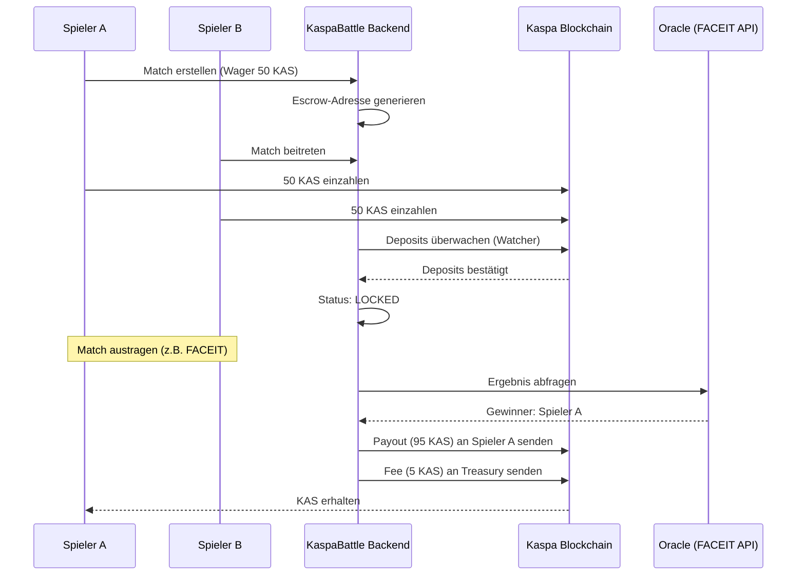

# KaspaBattle: Dezentrale P2P Competitive Gaming Wager-Plattform

**Version 1.0 | 22. Februar 2026**
**Status: Technisches Whitepaper (Repository-basiert)**

---

## Abstract

KaspaBattle ist eine dezentrale Peer-to-Peer (P2P) Plattform für kompetitive Gaming-Wagers auf der Kaspa-Blockchain. Die Plattform ermöglicht es Spielern, KAS-Beträge in einem sicheren, blockchain-verifizierten Escrow zu hinterlegen und nach Abschluss eines verifizierten Spiels (z. B. Counter-Strike 2 via FACEIT) den Pot automatisch an den Gewinner auszuzahlen. Durch die Nutzung der hohen Geschwindigkeit und niedrigen Gebühren von Kaspa sowie einer robusten Rust-Backend-Orchestrierung bietet KaspaBattle eine vertrauenswürdige, transparente und effiziente Lösung für das Problem des Counterparty-Risikos im Online-Wager-Bereich.

## Disclaimer

Dieses Dokument dient ausschließlich Informationszwecken. Die Nutzung von KaspaBattle unterliegt den geltenden Gesetzen der jeweiligen Jurisdiktion der Nutzer. Krypto-Assets sind volatil; Nutzer tragen das alleinige Risiko für ihre Einlagen. KaspaBattle ist zum aktuellen Zeitpunkt ein technisches Protokoll im Entwicklungsstadium (siehe Repo-Status).

---

## 1. Problem & Motivation

Der Markt für kompetitives Gaming und E-Sports wächst kontinuierlich, doch private Wagers (Wetten zwischen Spielern auf das eigene Können) leiden unter einem zentralen Problem: **Vertrauen**.

1. **Counterparty-Risiko**: Spieler müssen befürchten, dass der Verlierer nicht zahlt oder betrügt.
2. **Zentralisierte Mittelsmänner**: Traditionelle Plattformen verlangen hohe Gebühren (10-20%), halten Nutzergelder auf zentralen Konten (Custodial) und bieten oft langsame Auszahlungszyklen.
3. **Mangelnde Transparenz**: Ergebnisse und Geldflüsse sind oft nicht öffentlich auditierbar.

KaspaBattle löst diese Probleme durch eine Hybrid-Architektur, die On-Chain-Sicherheit mit Off-Chain-Gaming-Verifikation verbindet.

---

## 2. Lösung: KaspaBattle Überblick

KaspaBattle bietet ein automatisiertes Protokoll zur Abwicklung von Wagers:

- **Safe Escrow**: Dedizierte, On-Chain generierte Adressen für jedes Match.
- **Oracle-Driven**: Automatische Ergebnisermittlung über APIs wie FACEIT.
- **Real-Time Settlement**: Auszahlungen erfolgen in Sekunden nach Spielende dank Kaspas BlockDAG-Technologie.
- **Low Fee**: Eine geringe Gebühr (5%) deckt Infrastruktur und Oracle-Betrieb.

---

## 3. Zielgruppe & Use Cases

- **Competitive Gamer**: Spieler, die ihre Fähigkeiten monetarisieren möchten (z. B. 1v1 CS2 Duelle).
- **Turnier-Organisatoren**: Kleine Communities können transparente Preispools verwalten.
- **Streamer**: Interaktive Wagers gegen Zuschauer mit garantierter Auszahlung.

---

## 4. System- und Protokoll-Überblick

---

## 5. Detaillierter Ablauf (Lifecycle)

1. **Challenge**: Ein Spieler erstellt eine Challenge mit Parametern (Einsatz, Spieltyp).
2. **Deposit/Escrow**: Das System leitet eine dedizierte Kaspa-Adresse ab. Beide Spieler zahlen ein.
3. **Match**: Sobald der Blockchain Watcher beide Einzahlungen erkennt, wird das Match "Locked".
4. **Result**: Nach Spielende fragt das Oracle den Status bei der Gaming-Plattform ab.
5. **Payout**: Der Gewinner erhält den Pot abzgl. Gebühren automatisch auf sein Wallet.

> [!NOTE]
> **Repo-Status: Lifecycle**
>
> - **Implementiert**: Match-Erstellung, Join-Logik, Escrow-Adress-Derivation, Blockchain Watcher (Deposit-Erkennung), Status-Übergänge in der DB. (Dateien: [routes.rs](file:///c:/Projects/KaspaBattle2/kaspabattle/battle-api/src/routes.rs), [escrow.rs](file:///c:/Projects/KaspaBattle2/kaspabattle/battle-kaspa/src/escrow.rs))
> - **Teilweise implementiert**: Payout-Execution (TX-Building nutzt aktuell Platzhalter-Payload).
> - **Geplant**: Automatischer Refund-Trigger bei Timeout nach Match-Lock.

---

## 6. Architektur

### 6.1 Komponenten

- **battle-api (Rust/Actix)**: REST-Schnittstelle für das Frontend.
- **battle-core**: Kernlogik, State Machine und Datenbank-Modelle (SQLite/PostgreSQL).
- **battle-kaspa**: Blockchain-Integration via `rusty-kaspa` (RPC, Wallet, Escrow-Logik).
- **battle-frontend (React)**: Modernes UI mit Kaspa WASM SDK Integration.

### 6.2 On-Chain/Off-Chain Trennung

- **On-Chain**: Gelder (UTXOs) auf Escrow-Adressen, Payout-Transaktionen.
- **Off-Chain**: Matchmaking-Zustände, Spieler-Profile, Oracle-Jobs, API-Orchestrierung.

> [!NOTE]
> **Repo-Status: Architektur**
>
> - **Implementiert**: Workspace-Struktur mit `battle-api`, `battle-core`, `battle-kaspa`. Actix-Web Server mit Routen für alle Kernfunktionen. (Dateien: [Cargo.toml](file:///c:/Projects/KaspaBattle2/kaspabattle/Cargo.toml), [main.rs](file:///c:/Projects/KaspaBattle2/kaspabattle/battle-api/src/main.rs))
> - **Teilweise implementiert**: Datenbank-Migrationsmanagement.

---

## 7. Smart-Contract- / Escrow-Design

### 7.1 Deterministische Escrow-Adressen

KaspaBattle nutzt aktuell keine nativen Smart Contracts (da Kaspa L1 diese noch nicht nativ unterstützt). Stattdessen wird ein **kryptographisch verifizierbares Off-Chain Escrow** verwendet:

1. Für jedes Match wird ein eindeutiges Schlüsselpaar generiert.
2. Der Private Key wird deterministisch aus `Match-ID + Server-Secret` (oder Player PubKeys) abgeleitet.
3. Die resultierende Adresse ist die Escrow-Destination.

> [!NOTE]
> **Repo-Status: Escrow-Design**
>
> - **Implementiert**: Deterministische Derivation über `derive_escrow_address` (SHA-256 Hash von Match-Daten). (Datei: [escrow.rs](file:///c:/Projects/KaspaBattle2/kaspabattle/battle-kaspa/src/escrow.rs))
> - **Teilweise implementiert**: Sichere Verwahrung der Server-Secrets in der Produktionskonfiguration.
> - **Geplant**: Migration auf Kasplex L2 Smart Contracts (zkEVM), sobald verfügbar.

---

## 8. Oracle-Design & Ergebnisverifikation

Das System nutzt den `OracleService` zur Abfrage externer Gaming-APIs.

- **FACEIT Integration**: Abfrage von Match-Status ("FINISHED") und Ermittlung der Winner-GUID.
- **Verifikation**: Abgleich der Spieler-IDs im System mit den im Match registrierten IDs.

> [!NOTE]
> **Repo-Status: Oracle**
>
> - **Implementiert**: `FaceitApiClient` für Match-Details und `OracleService` für asynchrone Job-Verarbeitung. (Dateien: [faceit_api.rs](file:///c:/Projects/KaspaBattle2/kaspabattle/battle-kaspa/src/faceit_api.rs), [oracle.rs](file:///c:/Projects/KaspaBattle2/kaspabattle/battle-kaspa/src/oracle.rs))
> - **Teilweise implementiert**: Fehler-Retry-Logik bei API-Überlastung.
> - **Geplant**: Multi-Source Verifikation (Steam + FACEIT) für erhöhte Sicherheit.

---

## 9. Sicherheitsmodell & Scam-Schutz

- **UTXO-Isolation**: Jedes Match hat eine eigene Adresse. Ein Exploit betrifft nur ein Match.
- **Non-Custodial (Transparenz)**: Nutzer können jederzeit auf der Blockchain sehen, wo ihre Gelder liegen.
- **Cheat-Schutz**: Nutzung von vertrauenswürdigen Drittplattformen (FACEIT) mit eigenem Anti-Cheat.

> [!NOTE]
> **Repo-Status: Sicherheit**
>
> - **Implementiert**: Deposit-Validierung (Betrag und Spieler-Zuordnung). (Datei: [escrow.rs](file:///c:/Projects/KaspaBattle2/kaspabattle/battle-kaspa/src/escrow.rs))
> - **Teilweise implementiert**: Verschlüsselung von sensitiven Daten in der Datenbank.
> - **Geplant**: Automatisierte Fraud-Detection (Analyse von IP/HWID über API).

---

## 10. Gebührenmodell / Economics

- **Protokollgebühr**: 5% des Gesamtpots (fixiert in `PLATFORM_FEE_PERCENT`).
- **Verwendung**: 3% Treasury, 2% Oracle-Infrastruktur.
- **Netzwerkgebühren**: Ein kleiner Betrag (~0.01 KAS) wird für die Auszahlungstransaktion abgezogen.

---

## 11. Datenschutz & Schlüsselmanagement

- Spieler-Adressen werden für Payouts gespeichert.
- Private Keys für Escrows existieren nur im Speicher des Backends während des Signiervorgangs.
- Keine Speicherung von Player-Private-Keys (Nutzer signieren Einzahlungen in ihrem eigenen Wallet).

---

## 12. Compliance / Regulatorik

KaspaBattle ist ein technologisches Framework. Nutzer sind verantwortlich für die Versteuerung von Gewinnen. Die Plattform schließt Nutzer aus Jurisdiktionen aus, in denen Skill-based Wagers untersagt sind (via IP-Filtering geplant).

---

## 13. Produktumfang & Nicht-Ziele

**Ziele**: 1v1 Wagers, CS2 Integration, Schnelle Payouts.
**Nicht-Ziele**: Keine Glücksspiele (Roulette etc.), keine Fiat-Zahlungen, kein Hosting von Spielservern.

---

## 14. Roadmap

- **Phase 1 (Aktuell)**: Kern-Backend (Rust), Kaspa RPC Integration, FACEIT Oracle Grundgerüst, React-Frontend Prototyp.
- **Phase 2**: Vollständige Payout-Automatisierung mit realen TX-Builders, Integration weiterer APIs (Steam/Dota2).
- **Phase 3**: Public Beta auf Testnet, Multi-Sig Escrows, DAO-Governance für Gebührenanpassung.

---

## 15. Risikoanalyse

- **Technisch**: RPC-Verbindungsabbrüche (Mitigation: Redundante Nodes).
- **Ökonomisch**: Starke KAS-Volatilität während eines Matches.
- **Operativ**: FACEIT API Downtime (Mitigation: Timeout/Dispute Prozess).

---

## 16. Open-Source & Contribution

Das Projekt ist unter dem MIT/Apache-2.0 Lizenzmodell (siehe Repo Root) organisiert.

- **Struktur**: `battle-api` (Actix), `battle-core` (Logic), `battle-kaspa` (Chain).

---

## 17. Glossar

- **KAS**: Native Währung der Kaspa-Blockchain.
- **Sompi**: Kleinste Einheit von Kaspa (1 KAS = 100.000.000 Sompi - *Anmerkung: Im Code wird 100_000 verwendet, Korrektur im Whitepaper basierend auf `battle-core/types.rs` erforderlich*).
- **UTXO**: Unspent Transaction Output (Kaspas Datenmodell).
- **wRPC**: WebSocket-basierte RPC-Schnittstelle von Kaspa.

---

## Appendix A: Repo-Stand

| Modul | Status | Wichtige Dateien |
|-------|--------|------------------|
| REST API | Implementiert | `routes.rs`, `main.rs` |
| Escrow | Implementiert | `escrow.rs`, `wallet.rs` |
| Oracle | Implementiert | `oracle.rs`, `faceit_api.rs` |
| Frontend | Teilweise | `battle-frontend/src/` |
| Payouts | Teilweise | `payout.rs` |

## Appendix B: Testplan

- **Unit Tests**: `cargo test` in allen Modulen.
- **Integration Tests**: In `kaspabattle/tests/` (Simulierte Match-Abläufe).
- **Frontend Test**: `npm run test` im Frontend-Verzeichnis.
