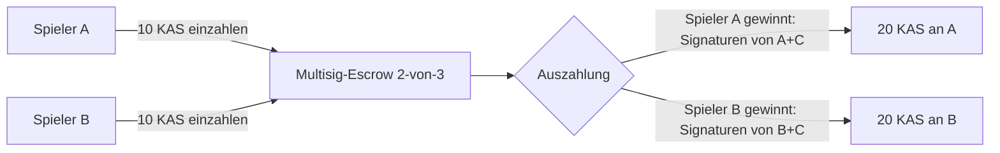
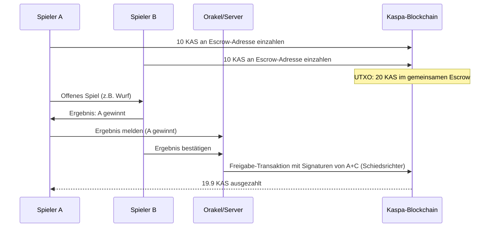

# Zusammenfassung (Executive Summary)

Kaspa ist derzeit **nicht** mit Turing-vollständigen Smart Contracts auf Layer 1 (L1) ausgestattet. Stattdessen setzt Kaspa auf ein **UTXO-basiertes Skriptmodell** ähnlich Bitcoin, ergänzt durch geplante *Covenant*-Erweiterungen. Zahlreiche offizielle Quellen und Roadmaps kündigen jedoch fortschreitende Features an: Beispielsweise ist ein **Covenants Hard Fork** für den 5. Mai 2026 geplant, der *programmierbare Ausgabebedingungen* (z. B. Zeit-Locks, Adressbeschränkungen, Multistufen-Autorisierungen) direkt in das Kaspa-UTXO-Modell einführt【41†L171-L179】【41†L193-L202】. Parallel dazu wird eine neue, hochsprachenähnliche **„SilverScript“-Sprache** samt SDK freigegeben, mit der Entwickler kontraktähnliche Regeln in einer „anwendungsähnlichen“ Form formulieren und zu Kaspa-Skripten kompilieren können【41†L171-L179】【41†L193-L202】. Dieses Covenant-System erweitert Kaspa um primitive Smart-Contract-Funktionalität, bleibt aber grundlegend ein **Ausgabebedingungs-Framework** (keine globale Zustandsmaschine auf L1).

Im Gegenzug werden komplexe Logiken heute über **Layer 2-Lösungen** realisiert. Beispielsweise ist mit **Kasplex** ein Ethereum-kompatibler zkEVM-Rollup gestartet, auf dem sich DeFi, NFTs und Spiele abbilden lassen. Kaspa dient hierbei als extrem schnelle Sequencer- und Datenverfügbarkeits-Schicht. Offizielle Dokumente betonen, dass Kaspa-L1 vorrangig die Sicherstellung von Sequenzierung, Verfügbarkeit und Abrechnung übernimmt【20†L99-L107】, während echte Berechnungen off-chain geschehen.

Dieses Dokument fasst alle verfügbaren Informationen zusammen: Es erläutert die derzeitigen L1-Skriptfunktionen (UTXO, OP-Codes, P2SH/Multisig, Time-Locks) und deren praktische Einsatzmöglichkeiten (z. B. 2-aus-3-Escrow), definiert und bewertet den Begriff **„Silverskript“**, analysiert das *Kaspa Battle*-Whitepaper im Hinblick auf L1-Umsetzbarkeit, vergleicht Konzepte (Multisig, Commit-Reveal, Schwellen-Signaturen, MuSig, EVM-Verträge) mit Bitcoin/Ethereum/L2 und gibt konkrete Implementierungshinweise (Skripte, CLI-Kommandos, Codebeispiele). Abschließend folgen Diagramme, Tabellen und ein Ausblick.

# 1. Offizielle Quellen und Roadmap

- **Kaspa-Entwicklungsseite**: Die offizielle Roadmap beschreibt die Zukunft der L1-Programmierbarkeit. Ein *“Covenants Hard Fork”* (Zielfrist: 5. Mai 2026) soll das UTXO-Modell um *vordefinierte Ausgabebedingungen* erweitern. Damit können Regeln wie Zeitverzögerung (Time Locks), Adressbeschränkungen oder mehrstufige Autorisierung direkt im Protokoll abgebildet werden【41†L171-L179】. Außerdem werden „smart wallets, vaults, native assets“ erwartet【41†L183-L185】. Zeitgleich erscheint eine neue Hochsprache namens **SilverScript** und passendes SDK, das Entwicklern ein höheres Abstraktionsniveau für diese Covenants bietet【41†L193-L202】. Diese Covenants-Ziele waren jüngst mehrfach bestätigt (Kaspa-Entwickler-Posts, Media-Berichte).

- **Kaspa Improvement Proposals (KIPs)**: KIP-10 (aktiver Vorschlag) führt neue OP-Codes zur Transaktions-Introspektion (z.B. `OpTxInputCount`, `OpTxOutputAmount` etc.) sowie 8-Byte-Arithmetik ein, um „fortgeschrittene Skriptbedingungen“ und komplexere Ausgaben zu ermöglichen【3†L279-L288】【3†L257-L264】. Diese Erweiterungen sollen anspruchsvollere Verträge (z.B. **mutual transactions**, wie in KIP-9 diskutiert) unterstützen. Andere KIPs (z.B. KIP-20) führen *Covenant IDs* als konsensgetrackte Kennungen ein, um die Identität von Zustandsübergängen zu verankern (stabile Vertragszustandsketten ohne aufwändige Ahnenbeweise)【16†L112-L121】【16†L136-L140】. 

- **vProgs (Verifiable Programs)**: Kaspa verfolgt ein Konzept namens *vProgs*, bei dem Programme off-chain ausgeführt werden und ihre Korrektheit auf L1 in Form von kryptographischen Gültigkeitsnachweisen geprüft wird【6†L245-L253】【41†L241-L249】. Dies ist ein zukunftsweisender Ansatz für „Ausführung ohne VM“, der L2-Anwendungen ans L1 ankoppeln kann (z.B. zk-Rollups oder externe Logik). Geplant ist später auch vProgs v2 (2026–27) mit einem eigentlichen L1-Ausführungsrahmen, allerdings ohne traditionelle globale Zustände【6†L263-L272】【41†L268-L275】. 

- **Kaspa Battle Whitepaper** (Feb 2026): Ein Community- und ecosystemales Whitepaper (KaspaBattle) skizziert ein P2P-Spielprotokoll. Es betont den **Hybridansatz**: On-Chain Escrow (via Kaspa-UTXO), Off-Chain-Spiel und Orakel-Gewinnverifizierung【9†L19-L27】【41†L169-L177】. Wichtige Punkte:
  - **Escrow-Generierung**: Für jedes Spiel wird eine eindeutige Kaspa-Adresse (UTXO) erstellt. Beide Spieler zahlen ein, und das Guthaben wird gesichert (split nicht möglich).
  - **Ergebnis-Verifizierung**: Das Spielergebnis wird extern (off-chain) bestimmt und von einem Orakel-Netzwerk (z.B. Chainlink) signiert. Nach Erhalt löst eine Auszahlung auf den Gewinner aus.
  - **Entwicklungsplan**: KaspaBattle will später auf Kasplex (L2) migrieren und das Escrow-Setup zu einem echten Multisig (3-aus-5) ausweiten, um Vertrauensrisiken zu minimieren. 

Damit zeigt sich: **Aktuell sind komplexe Spiele/Verträge auf Kaspa nur mithilfe von Off-Chain-Logik und/oder Orakeln möglich**. Reine L1-Mittel erlauben zwar sichere Escrows, aber keine echte Zufalls- oder Spielausführung.

# 2. Kaspa Layer-1 Skript-Fähigkeiten

Kaspa übernimmt Bitcoinns UTXO-Modell mit einer **Skript-Sprache** für Ausgabebedingungen【30†L252-L259】. Wichtige Charakteristika:

- **Forth-ähnliche Scripts**: Stapelbasierte Sprache (ähnlich Bitcoin Script), **nicht Turing-vollständig**【30†L252-L259】. Keine Schleifen, keine persistenten Variablen. Nur einfache Branches, Hash-/Signaturprüfungen, Arithmetik etc. 
- **OP-Codes**: Kaspa bietet Klassiker wie `OP_DUP`, `OP_HASH160`, `OP_CHECKSIG`, `OP_CHECKMULTISIG`, sowie Bitcoinkodes für Hashprüfung (`OP_SHA256` etc.) und Time-Locks (`OP_CHECKLOCKTIMEVERIFY`, `OP_CHECKSEQUENCEVERIFY`). Der Entwickler kann mehrere dieser Operationen kombinieren. Mit KIP-10 kommen neu hinzu: Transaktions-Abfrages (InputCount, OutputAmount, etc.) und 8-Byte-Arithmetik【3†L279-L288】.
- **Pay-to-Public-Key-Hash (P2PKH)**: Standard-Ausgabe: Skript-Pubkey `OP_DUP OP_HASH160 <PKH> OP_EQUALVERIFY OP_CHECKSIG`. Dieser bestätigt, dass derjenige eine gültige Signatur für den zugehörigen Public Key liefert【30†L252-L259】.
- **Pay-to-Script-Hash (P2SH)**: Zugelassen – Funds gehen an den Hash eines Scripts【38†L299-L305】. Beim Einlösen muss das gesamte Redeem-Script vorgelegt werden. Kaspa unterscheidet sich hier kaum von Bitcoin: Multisig und andere Logik verbergen sich hinter dem P2SH-Hash【38†L299-L305】.
- **Multisignaturen (OP_CHECKMULTISIG)**: Unterstützt. Ein typisches n-aus-m-Multisig-Skript (lokal definiert, dann P2SH-gehasht) lautet z. B. 
  ```bash
  2 <PubKeyA> <PubKeyB> <PubKeyC> 3 OP_CHECKMULTISIG
  ```
  Das heißt: von drei Public Keys müssen mindestens zwei gültige Signaturen vorliegen, damit die Coins ausgegeben werden können【38†L275-L283】【38†L299-L305】. Dabei wird beim Auszahlen nicht das Script im Blockchain-Zustand gehalten, sondern nur der Hash. Die Script-Ausführung erfolgt einzig beim Spenden einer UTXO.  

- **Time-Locks und zeitbasierte Logik**: Durch `OP_CHECKLOCKTIMEVERIFY` (absolute Zeit) oder `OP_CHECKSEQUENCEVERIFY` (Block-Abhängig) können Ausgaben bis zu einem bestimmten Zeitpunkt gesperrt werden. Offiziell werden solche *Zeitpläne* (“release schedules”) in den Covenants erwähnt【41†L173-L177】. Entwickler können das heute schon mit dem Kaspa-Skriptbaukasten (und `kaspawallet`) abbilden. 

**Aktuelle Einschränkungen:** Es gibt kein globales Contract-State oder Event-Handhabung auf L1. Alle Bedingungen gelten nur einmalig für eine UTXO-Ausgabe. Keinerlei persistente „Variablen“. Kein eingebauter Zufall. Damit fehlen grundlegende Smart-Contract-Funktionen (z.B. automatische Trigger, komplexe if/else-Logik, Schleifen), wie man sie von Ethereum her kennt【30†L252-L259】.  

# 3. Multisignatur auf Kaspa Layer 1

Multisignatur-Wallets (z.B. 2-aus-3) werden heute **vollständig unterstützt**, allerdings auf Basis der Script-Mechanismen (P2SH + OP_CHECKMULTISIG)【38†L275-L283】【38†L299-L305】. 

- **Erstellen einer Multisig-Adresse (Escrow)**: Mit dem CLI-Wallet kann man z.B. eine 2-von-3-Multisig-Wallet so anlegen:
  ```bash
  kaspawallet create --min-signatures=2 --num-private-keys=3 --num-public-keys=3
  ```
  Das erzeugt drei Schlüsselpaare und eine Adresse. Dahinter steht technisch ein Script (siehe oben) und die Adresse wird zum Hash dieses Scripts【38†L275-L283】. 

- **Einzahlen (UTXO-Fluss)**: Alle Beteiligten senden ihre Beträge (z.B. 10 KAS von A, 10 KAS von B) an genau diese Multisig-P2SH-Adresse. Kaspa speichert dann ein gemeinsames UTXO über total 20 KAS unter dem Hash dieses Skripts. **Keiner der Beteiligten kann allein über diese Coins verfügen.**

- **Transaktionsausführung**: Zum Auszahlen muss eine neue Transaktion mit diesem UTXO als Input erstellt werden. Im ScriptSig müssen mindestens zwei gültige Signaturen (hier z.B. von A und C, oder B und C) zusammen mit dem ursprünglichen Redeem-Script präsentiert werden. Ist die Bedingung erfüllt (`OP_CHECKMULTISIG` stimmt), wird das Geld freigegeben. Jede Transaktion wird vollständig on-chain überprüft. 

- **CLI-Ablauf**: In der Praxis läuft das etwa so:
  1. Jeder erstellt seinen „Sub-Wallet“ (mithilfe von `--num-private-keys=1 --import`) und teilt seine erweiterte Public Key Chain.
  2. Beim Erstellen der 3-von-5-Wallet geben alle ihre Extended-Pubkeys ein (siehe Wiki-Beispiel【38†L323-L333】).
  3. Ein Nutzer erstellt eine **unsigned transaction** mit `create-unsigned-transaction`.
  4. Die Transaktion wird von mindestens 3 Teilnehmern nacheinander signiert (`kaspawallet sign`), jeder fügt seine Signatur hinzu【38†L339-L348】【38†L351-L360】.
  5. Ist das Mindestquorum erreicht, kann einer den fully signed TX mit `broadcast` senden【38†L373-L381】.

- **Nutzbarkeit und UX**: Ja, Multisig funktioniert mit dem Standard-Stack (siehe Wiki-Tutorial【38†L275-L283】). Allerdings ist es ein **manueller Prozess**: Man erstellt Transaktionen, verteilt sie, wartet auf Unterschriften, prüft die Inputs manuell etc. Es ist kein „rund um automatischer Smart Contract“. Dafür braucht es eine Koordination (Server, Absprachen). Die Sicherheitsgarantien entsprechen denen von Bitcoin-Multisigs: Solange mindestens zwei Schlüssel ehrlich mitspielen, kann niemand unautorisierte Auszahlungen erzwingen, und keiner kann die Coins allein blockieren【38†L299-L305】. 

- **Begrenzungen**: Durch die Natur des UTXO-Modells gibt es keine wiederverwendbaren Kontostände. Man muss bei jedem Auszahlen ein neues UTXO mit neuem Script erzeugen. Es gibt auch keine nativ integrierten Multi-Signatur- oder Schwellen-Signatur-Schemata jenseits von OP_CHECKMULTISIG. (Kaspa nutzt intern Schnorr-Signaturen für normale Adressen, aber einen MuSig- oder Taproot-ähnlichen Aggregationsmechanismus für M-of-N gibt es **noch nicht**【7†L1-L0】.)  

**Fazit:** Praktisch gesehen ist Kaspa-Multisig gut nutzbar für Escrow, Vaults, Treuhand und gemeinschaftliche Wallets. Man erstellt die P2SH-Adresse per CLI, alle zahlen ein, und 2-aus-3-Signaturen entlassen das Geld【38†L275-L283】. Es ist jedoch kein Smart Contract, sondern nur eine *Spend-Bedingung* (Multisig-Skript). Komplexe Logik (Zufall, Spiele, Verwertung) muss weiter off-chain oder später via Covenants verwirklicht werden.


*Diagramm: Kaspa Multisig-Escrow für Kopf-oder-Zahl – beide Spieler zahlen 10 KAS ein. Bei Ergebnisermittlung signieren der Gewinner zusammen mit dem Schiedsrichter (C). Dann wird der gesamte Topf an den Gewinner ausgezahlt.* 

# 4. „Silverskript“ – Begriffsklärung und Kritik

Der Begriff **„Silverskript“** (engl. *SilverScript*) wird informell oft als Synonym für Kaspa-Smart-Contract-Fähigkeiten genutzt. Technisch bezeichnet es aber eine konkrete Entwicklungsinitiative:

- **SilverScript (sprich „Silverskript“)** ist die **Markenbezeichnung für eine neue Hochsprache und Compiler-Suite** von Kaspa, die zusammen mit dem Covenants-Hard-Fork ausgerollt werden soll【41†L193-L202】. In der offiziellen Roadmap heißt es: *„A high-level programming language… for authoring covenant-based logic within Kaspa transactions. SilverScript allows developers to define conditional spending rules… which can then be compiled into covenant constraints【41†L193-L202】.“* Es handelt sich also um eine Art „Appsprache“, die wie etwa CashScript (für BCH) oder Ivy (für Bitcoin) funktionieren soll. 

- **Kritische Einordnung**: Silverskript ist kein neuer virtueller Computer, sondern ein **Compiler-Tool**. Aktuell ist es **experimentell** und nur auf Testnet verfügbar【16†L52-L61】. Auf Mainnet existiert es noch nicht. Der Name ist eher „Marketing“; technisch arbeitet man immer noch mit dem UTXO-Modell und Kaspa-Script im Hintergrund. SilverScript mappt statisch auf Skriptbedingungen (Covenants)【41†L193-L202】【16†L53-L61】. Man könnte es genauer als **„kaspa­spezifische Covenant-DSL“** bezeichnen.

- **Alternativer Terminus**: Anstelle „Silverskript“ zu sagen, ist es präziser, von **Covenant-Skripten** oder **Kaspa-Skripterweiterungen** zu sprechen. Beispielsweise spricht Kaspa offiziell von *“covenant-based logic”* bzw. *“programmable covenants”*【41†L171-L179】【41†L193-L202】. In Diskussionen werden „KIP-20 (Covenant IDs)“ und „KIP-xx (API-Erweiterungen)“ genannt. Silverskript selbst wird als oberstes Bedienfeld zu dieser Covenant-Infrastruktur verstanden【16†L111-L120】【16†L136-L139】. 

- **Zusammenfassung**: *„Silverskript“* ist also **nicht** eine isolierte Technologie, sondern das nächste Tooling-Release im Covenant-Stack. Es ist „höherer Rohguss“ für das, was man grundsätzlich auch per P2SH/Covenants machen könnte. Bislang gibt es keine offizielle Standard-„Silverskript-Sprache“ mit eigenen OpCodes; alles läuft konzeptionell über Kaspa Script mit neuen Regeln. Wer präzise reden will, spricht besser von *programmable covenants* (veriprogrammierte Ausgaberegeln) oder dem Kaspa-Script mit zusätzlichen OPs (KIP-10, KIP-20 usw.), und nennt die Sprache lieber „SilverScript (DSL)“【16†L55-L64】【41†L193-L202】.

# 5. Kaspa Battle Whitepaper: L1 vs L2

Das **KaspaBattle-Whitepaper (Feb 2026)** beschreibt ein wettbasiertes Zwei-Spieler-Spiel. Relevante Architektur-Merkmale sind:

- **Hybridansatz:** Das Spiel findet **off-chain** statt. On-Chain wird nur ein Escrow verwaltet und die Auszahlung veranlasst. Die eigentliche Spielelogik und Ergebnisberechnung werden extern gehandhabt.

- **Escrow auf L1:** Beide Spieler zahlen ihren Einsatz an dieselbe eindeutige 2-aus-3-Multisig-Adresse ein. Das Guthaben (z.B. 100 KAS total) liegt blockdag-öffentlich in einem UTXO. Jeder kann die Escrow-Adresse prüfen (Kaspa-Explorer) und sicherstellen, dass die richtigen Beträge eingegangen sind【38†L275-L283】. Dies entspricht genau dem in Abschnitt 3 beschriebenen Multisig-Verfahren.

- **Auszahlung:** Nach Bekanntgabe des Spielausgangs signieren der Gewinner plus der Schiedsrichter („Oracle“) gemeinsam. In der Praxis wird z.B. A+C signieren, um A 95 KAS (minus Gebühr) auszuzahlen. Weil 2 Signaturen reichen, ist dies gültig【38†L275-L283】. Wenn beide Spieler sich einig sind, könnten auch A+B signieren, aber im Streitfall greift eben der Schiedsrichter-Trust-Mechanismus. 

- **Orakel/Verifizierung:** Das Whitepaper geht davon aus, dass das Ergebnis (z.B. „Spieler A gewinnt“) von einem externen Orakelnetz attestiert wird, etwa über Chainlink Nodes oder ein selbstgebautes System. Kaspa selbst kennt das Ergebnis **nicht** automatisch; die Auszahlungstransaktion muss Off-Chain vorbereitet und signiert werden. Es gibt **keine on-chain API** in Kaspa, die „Spielergebnis: A gewinnt“ einliest.

- **L1-Umsetzbarkeit:** 
  - Die Geld-Einzahlung und -Auszahlung kann **vollständig auf Kaspa L1** ablaufen – sie nutzen normale Transaktionen und Multisig-Skripte. 
  - Die im Whitepaper genannten Fortschritte (z.B. Escrow-Key-Management wird von einem zentralen Key zu 3-von-5 umgebaut) sind direkt auf der L1-Skripting-Ebene möglich.
  - **Nicht L1-fähig** sind dagegen: Automatische Spiellogik, Zufallsfunktion („fairer Wurf“), Ergebnisentscheidungen. Dafür braucht man externes Oracle- oder Off-Chain-Logging. 

- **L2-Perspektive:** Das Whitepaper skizziert, dass ein späterer „Voll-Umbau“ auf **Kasplex L2 (Kaspa’s zkEVM-Rollup)** erfolgen soll. Dort könnten Smart Contracts (z.B. Solidity) das Spiel vollständig on-chain erledigen, inklusive Outcome-Logik. Aktuell dienen L2-Umgebungen eher dazu, den Trust im Orakel zu minimieren oder das Escrow-Multisig zu entlasten. KaspaBattle erwähnt, dass schließlich sogar die gesamte Escrow-Logik auf einen voll dezentralen Smart Contract (auf Kasplex) migriert werden könne. 

- **Umsetzungsmuster:** 
  - **Auf L1 heute** bietet sich an: 2-out-of-3 Escrow in einem einzigen UTXO (wie oben beschrieben), kombiniert mit Off-Chain-Orakelentscheidung. Ein Schema:
    1. *Einrichtung:* Backend generiert neues Schlüsselpaar (P2SH), Spieler zahlen ein.
    2. *Spielen:* Ergebnisse werden off-chain ermittelt.
    3. *Auszahlung:* Backend schickt TX mit 2 v. 3 Signaturen (Gewinner+Orakel) on-chain.
  - **Alternativen:** Für echte Fairness könnte theoretisch ein Commit-Reveal-Schema auf L1 versucht werden (z. B. Spieler A übermittelt zunächst einen Hash, Spieler B legt eine Signatur fest, A offenbart das Geheimnis). In Bitcoin-artigen Skripten ist das sehr mühsam und riskant (z. B. kann A „nicht aufdecken“). Daher hält das Whitepaper den Orakelansatz für praktikabler.
  - **L2/Orakel-Integration:** In Zukunft kann ein Oracle als On-Chain-„Zeuge“ agieren (bei vProgs/oder MEC-Vote-Mechanik), doch aktuell ist das nicht implementiert. Die Kaspa-Dev-Roadmap erwähnt zwar Oracle-Voting-Mechanismen【20†L131-L139】, aber diese sind experimentell (EVM-Lösungen, oder Miner-Abstimmung).

- **Zusammenfassung:** **Auf Kaspa L1 sind die Eskrow-Finanzflüsse problemlos realisierbar (Multisig-UTXO)**. Was fehlt, ist echter on-chain Code für das Spiel selbst. Das Battle-Whitepaper bestätigt: Spiel- / Ergebnislogik muss extern gehandhabt werden; die Blockchain dient nur zur manipulationssicheren Abwicklung der Geldflüsse. Einige Teile (Einzahlung, einfache Auszahlung mit Signaturen) können mit heutiger L1-Skriptingtechnik abgebildet werden, während anspruchsvollere Elemente (Zufall, mehrfacher Verlauf, automatisierte Auslösung) ein Layer-2-Vertragsumfeld oder Orakel erfordern.

# 6. Vergleich mit Bitcoin, Ethereum, EVM-kompatiblem L2

| **Feature**            | **Bitcoin (L1)**                              | **Ethereum (L1)**                           | **EVM-kompatible L2** (z.B. Kasplex)         |
|------------------------|----------------------------------------------|---------------------------------------------|---------------------------------------------|
| **Multisignatur**      | P2SH + OP_CHECKMULTISIG (scriptbasiert)【38†L275-L283】; 2-of-3 etc. | Üblicherweise als Smart Contract (z.B. Gnosis Safe). Keine native M-of-N, sondern Code-Implementierung. | Wie Ethereum: Smart Contracts oder vom Protokoll unterstützt, je nach L2. Kasplex ermöglicht Solidity-Mehrfachsig (via Contract). |
| **Commit–Reveal**      | Möglich über Hashlocks & Time-Locks im Script (z.B. `OP_SHA256 <hash> OP_EQUAL`)【41†L175-L177】. Aufwand: Scripts müssen vorplanen, komplex, anfällig. | In Smart Contracts leicht programmierbar (z.B. zwei Funktionen `commit()` und `reveal()`, Zustand im Contract). | Vollständiger EVM-Funktionen verfügbar; unterscheidet sich kaum von Ethereum (z.B. Commit-Reveal in Solidity). |
| **Threshold Sig (MuSig)** | In Bitcoin (ab Taproot) in Entwicklung: Aggregierte Schnorr (MuSig2) kann n-of-n als Single-Signatur. Bislang nur Konzept/KIP-Level. | Nativ gar nicht. ECDSA auf Ethereum kann in theoretischen Konstrukten (z.B. BLS, RSA-CCS) simuliert, aber nicht nativ. | EVM-Compatible: Unterstützt was Ethereum hat (keine native MuSig); man kann aber in Contract svgl. MultiSig umgehen. Kasplex (zkEVM) könnte künftige native Schnorr unterstützen, aber aktuell nicht. |
| **Smart Contracts**    | Kein VM: Nur Daten & Klauseln. Keine globalen Zustände, Schleifen etc. (Einmalige Script-Ausführung). | Vollumfängliche Turing-VM (EVM). Zustandsmaschine, Events, Gas Limit, DeFi und Games nativ. | Kommt darauf an: Bei EVM-Rollups (z.B. Arbitrum, Kasplex) 1:1 mit Ethereum Smart Contracts (vollständig kompatibel). Bei ZK-Rollups (non-EVM) andere Sprachen (StarkNet, Optimistic etc.). Kasplex ist Solidity-kompatibel. |
| **Zeitorakel**         | Eingeschränkt: Kann nur Datum/BlockTime prüfen (`CLTV`/`CSV`). | Nicht nativ; Orakel per Contract nötig (z.B. Chainlink). Orakel-Aufruf und Antwort im Contract. | Je nach L2: EVM-Lösungen nutzen Oracle-Provider (wie Ethereum). Nicht automatisch durch L1. |
| **Programmierbarkeit** | Sehr beschränkt (eine Transaktion = ein Skript ohne Nebenwirkung). | Hoch (Turing-komplett, Speicher, Iterate, Input/Output). | Voll: wie Ethereum (Smart Contracts) oder entsprechend Plattform (Kasplex ist zkEVM). |  

# 7. Implementierungsvorschläge mit Beispielen

## 7.1 Multisig-Script-Beispiel

Für ein **2-von-3-Multisig** auf Kaspa schreibt man (Redeem-Script):
```
2 <PubKey_A> <PubKey_B> <PubKey_C> 3 OP_CHECKMULTISIG
```
Mit dem Kaspa-CLI generiert man das so: 

```bash
kaspawallet create --min-signatures=2 --num-private-keys=3 --num-public-keys=3
```
(Dieser Befehl erstellt 3 Schlüssel und eine Adresse, deren Skript obiges Muster hat【38†L275-L283】.)  

**Auszahlungs-Transaktion:** Wenn Spieler A gewinnt, signieren A und der Schiedsrichter. Die resultierende Transaktion könnte (vereinfacht) so aussehen:
- Inputs: den zuvor erstellten 20 KAS-UTXO (von Multisig-Adresse).
- Outputs: Empfänger = A’s Address (20 KAS abzüglich Gebühr).
- ScriptSig: 
  1. (Platzhalter, weil OP_CHECKMULTISIG-Kuriosum – Bitcoin-Bug: extra OP_0),
  2. Signatur_A, Signatur_C, 
  3. Das oben genannte Redeem-Script als Bytes.

Wenn geprüft, matcht das OP_CHECKMULTISIG: Es benötigt 2 Signaturen (A+C) und 3 Keys insgesamt. Transaktion ist gültig.  

**Wichtige CLI-Schritte:** 
```bash
# 1. Erstelle unsigned TX (z.B. als Spieler A):
kaspawallet create-unsigned-transaction --send-amount=19.9 -t <Adresse_von_A>
# 2. A signiert:
kaspawallet sign --transaction=<TX_Daten>
# 3. Orakel/C signiert die teilweise signierte TX:
kaspawallet sign --transaction=<TX_Daten>
# 4. Ausstrahlen:
kaspawallet broadcast --transaction=<TX_Daten>
```
(Diese genauen Befehle entsprechen dem Wiki-Beispiel【38†L373-L381】.)

## 7.2 Time-Lock-Variante

Ein einfaches Beispiel für ein **zeitgesperrtes Multisig**: Man will, dass eine Ausgabe erst ab Blockzeit X ausgegeben werden kann, obwohl 2 der 3 signieren. Dafür erweitert man das Script:

```
<timestamp> OP_CHECKLOCKTIMEVERIFY OP_DROP 2 <PK1> <PK2> <PK3> 3 OP_CHECKMULTISIG
```
Erklärung:
- `<timestamp>` ist eine UNIX-Zeitmarke (oder Blockhöhe) – z.B. `1651369200`.
- `OP_CHECKLOCKTIMEVERIFY` verlangt, dass die Transaktion noch nicht vor diesem Zeitpunkt getätigt werden darf.
- `OP_DROP` entfernt den Zeitwert von Stack, bevor die Multisig-Prüfung folgt.
- Der restliche Teil ist wie gewohnt das 2-von-3-Skript.

So kann z.B. nur nach dem Datum X ausgezahlt werden – als Sicherheitsnetz, falls z.B. der Schiedsrichter die Transaktion verzögert. (Diese Zeitfunktion ist bereits heute ein Baustein der Covenant-Logik【41†L175-L179】.)

## 7.3 Commit–Reveal-Skizze

Ein Kaspa-ähnliches **Commit–Reveal** geht so:
1. Spieler A generiert einen Zufallswert `r` und berechnet `H = SHA256(r || C)` (C = eure gemeinsame Herausforderung). Er sendet den Hash `H` in einer Transaktion (z.B. gepinnt in einer kleinen UTXO oder als Teil eines Skripts mit `OP_SHA256 <H> OP_EQUALVERIFY`).
2. Spieler B antwortet öffentlich mit seiner Wahl.
3. Spieler A gibt `r` (Randomness) frei. Das Script vergleicht im Auszahlungs-Skript `OP_SHA256 r||C OP_EQUALVERIFY` plus `OP_CHECKSIG`. 

In der Praxis ist das auf Kaspa umständlich und riskant (Spieler könnten sich weigern, `r` offenzulegen). Deshalb empfehlen Entwickler oft stattdessen ein Off-Chain-Protokoll oder einfach Orakel. Für echte Fairness ist Ethereum oder spezialisierte L2 deutlich geeigneter.

## 7.4 Anleitung für Entwickler & Tests

- **Node/Wallet Setup:** Lade das offizielle Kaspa-Repo (Go oder Rusty). Stelle sicher, dass du `kaspad` und `kaspawallet` laufen hast. Zum Testen empfiehlt sich ein **Kaspa-Testnet** (z.B. benutzen die Whitepaper-Autoren Testnet-12). 
- **Wallet CLI:** Experimentiere mit `kaspawallet` im Debug-Modus (`-v`). Erstelle Wallets, neue Addresses, probiere `--utxoindex` aus (wichtig für Multisig-Abfrage). 
- **Escrow-Skripte:** Nutze `kaspawallet create ... --num-public-keys` wie oben. Lerne, wie `parse` eine TX anzeigt.
- **Broadcast & Verifikation:** Nach der Erstellung einer Broadcast-Transaktion solltest du mit einem Explorer oder dem CLI-Befehl `getutxos` den neuen UTXO-Status prüfen.
- **Time-Lock-Tests:** Simuliere Zeitverzögerung, indem du Tranasaktionen vor/nach einem bestimmten Timestamp prüfst. 
- **Commit-Reveal (optional):** Implementiere ein Proof-of-Concept-Skript wie oben auf einem privaten Netzwerk, um die Grenzen zu verstehen. 

### Sicherheit und Checkliste
- **UTXO-Konsistenz prüfen:** Stelle sicher, dass Eingangs- und Ausgangssumme übereinstimmen (kein Stillhalten).
- **Schlüsselmanagement:** Bei echten Multisigs müssen alle Extended Pubkeys gesichert und geteilt werden, sonst geht Guthaben verloren【38†L294-L302】.
- **Skript-Korrektheit:** Verifiziere lokal, dass Redeem-Skript und Signaturzählung wie erwartet sind. Achte darauf, beim Broadcast die vollständige Signaturkette zu haben (siehe Reddit-Issue【34†L103-L112】).
- **Zeitangaben:** Bei Zeit-Skripten nutze GMT-Unixzeit bzw. korrekte Kaspa-Netzwerk-Epoche.
- **Orakel-Sicherheit:** Nutze zertifizierte Off-Chain-Protokolle (Chainlink etc.) nur, wenn Konsequenz akzeptabel; sonst könnte ein böses Orakel die Auszahlung betrügen.
- **Testnet prüfen:** Führe alle Experimente zuerst im Testnet durch.

# 8. Diagramme und Tabellen

Neben den oben gezeigten Abläufen können folgende Visualisierungen hilfreich sein:


*Sequenzdiagramm: Multisig Escrow und Off-Chain-Spiel. A und B zahlen ein, spielen, und lassen via Orakel den Gewinner auszahlen.*  

| **Option**            | **Kaspa L1 (jetzt/Pläne)**                  | **Ethereum L1**                      | **EVM-L2 (z.B. Kasplex)**               |
|-----------------------|---------------------------------------------|--------------------------------------|-----------------------------------------|
| *Multisig*            | P2SH + OP_CHECKMULTISIG【38†L275-L283】        | Implementierung via Contract         | EVM-Contract oder native, je nach L2   |
| *Commit–Reveal*       | Möglich über SHA256-Hash und OP_EQUAL (kompliziert) | Einfach per Contract (Stateful)     | Wie Ethereum (Contracts oder L2-Features) |
| *Schwellen-Sign. (MuSig)* | Nicht nativ (nur OP_CHECKMULTISIG)        | Nicht nativ (EVM-Primär ECDSA)       | -                                      |
| *Smart Contracts*     | Nur Skripte (kein VM)【30†L252-L259】         | Vollständige Turing-VM (EVM)         | Voll kompatibel mit EVM (z.B. Solidity) |
| *Zufall/Orakel*       | Keinerlei native Zufall; Orakel benötigt     | Orakel-Provider (z.B. Chainlink)     | Gleiche Orakel-Lösungen wie Ethereum     |
| *Zeit-Locks*          | `OP_CLTV/CSV` wie Bitcoin【41†L171-L177】     | `block.timestamp` in Contract       | EVM/Timestamp der L2-Chain              |

# 9. Schlussfolgerung und Ausblick

- **L1 heute**: Kaspa L1 ist extrem schnell und skalierbar, eignet sich als Settlement-Layer mit sicherer UTXO-Abwicklung. Direkte Smart Contracts im Ethereum-Stil gibt es **noch nicht**. Multisignatur-Transaktionen (2-aus-3, 3-aus-5, etc.) sind jedoch vollständig **nutzbar** via P2SH-Skripte【38†L275-L283】.  
- **Roadmap**: Der offizielle Plan sieht vor, ab Frühjahr 2026 erste programmierbare Features (Covenants + SilverScript) zu aktivieren【41†L171-L179】【41†L193-L202】. Das wird Kaspa nativ (d. h. auf L1) in Richtung „Smart Contract Light“ bewegen, ohne aber eine Turing-VM einzubauen. Offene Fragen (genaue Syntax von SilverScript, Umfang der Covenants) klären sich in kommenden KIP-Prozessen und Testnet-Releases. 
- **Layer 2 & vProgs**: Parallel laufen zukunftsweisende Konzepte wie basierte ZK-Rollups (Kasplex), vProgs und Orakel-Protokolle【20†L99-L107】【41†L241-L249】. Diese ermöglichen echte dApp-Logik off-chain mit L1-Verankerung. Für Entwickler bedeutet das: komplexe Anwendungen baut man vorerst auf solchen L2-/Protokoll-Lösungen (Solidity, zk-STARKs etc.), während L1-Covenants einfache Bedingungen abbilden.

**Nächste Schritte für Entwickler:** Wer Kaspa programmatisch nutzen will, sollte sich mit den aktuellen Tools vertraut machen (kaspad, kaspawallet CLI) und erste Scripts/Contracts auf Testnet-Instanzen ausprobieren. Bei Interesse an zukünftigen L1-Funktionen lohnt es sich, die aktuellen *Kaspa Improvement Proposals (KIPs)* und Testnet-Releases zu verfolgen.  

**Quellen:** Offizielle Kaspa-Webseite und -Roadmap【41†L171-L179】【41†L193-L202】【6†L245-L253】, Kaspa KIPs【3†L257-L264】, Kaspa-Battle-Whitepaper, Kaspa-Wiki【38†L275-L283】 und Community-Medien【16†L55-L64】【20†L99-L107】.