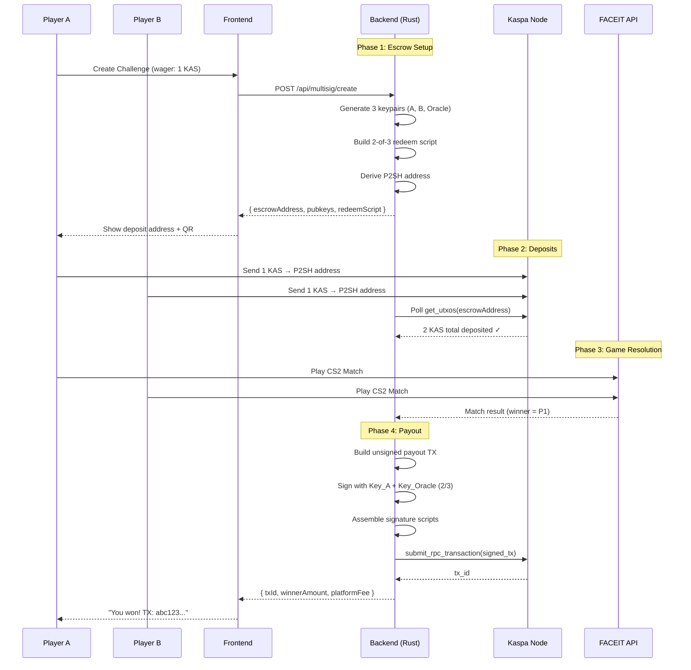
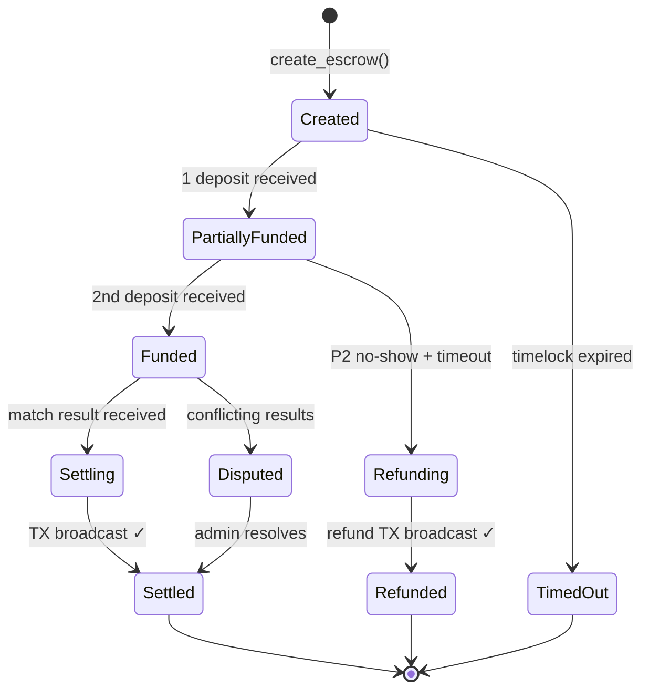

# KaspaBattle Multisig Escrow — Architecture Overview

## System Architecture



## Component Diagram

```mermaid
graph TB
    subgraph "Frontend (TypeScript)"
        FE_MS[multisig.ts<br/>Interfaces + API helpers]
        FE_W[wallet.ts<br/>Deposit sending]
    end

    subgraph "Backend (Rust)"
        subgraph "multisig module"
            M_TYPES[types.rs<br/>EscrowStatus, MultisigEscrow<br/>SignatureBundle, PayoutInstruction]
            M_SCRIPTS[scripts.rs<br/>build_multisig_redeem_script<br/>redeem_script_to_address<br/>build_multisig_sig_script]
            M_TX[transaction.rs<br/>create_unsigned_payout_tx<br/>compute_all_sighashes<br/>sign_sighash, assemble_signed_tx]
            M_SVC[service.rs<br/>MultisigEscrowService<br/>create, check, payout, refund]
        end

        ESC[escrow.rs<br/>Legacy P2PK escrow]
        PAY[payout.rs<br/>Legacy P2PK payout]
        ORC[oracle.rs<br/>FACEIT result verification]
        RPC[rpc.rs<br/>KaspaRpc trait + RealKaspaClient]
        MOCK[mock.rs<br/>MockKaspaClient (testing)]
    end

    subgraph "Kaspa Network"
        NODE[Kaspa Node<br/>wRPC + Borsh]
    end

    FE_MS --> M_SVC
    FE_W --> NODE
    M_SVC --> M_SCRIPTS
    M_SVC --> M_TX
    M_SVC --> RPC
    M_TX --> M_SCRIPTS
    ORC --> M_SVC
    RPC --> NODE
    MOCK -.-> RPC
```

## Key Roles & Signing Policy

| Role | Key Holder | Purpose | Signs For |
|------|-----------|---------|-----------|
| **Player A** | Backend (v1) | First bettor | Payouts, Refunds |
| **Player B** | Backend (v1) | Second bettor | Payouts, Refunds |
| **Oracle** | Backend | Platform authority | Payouts, Refunds, Disputes |

### Signing Combinations (2-of-3)

| Scenario | Signers | Who Initiates |
|----------|---------|---------------|
| **Winner Payout** | Winner key + Oracle | Automated after match result |
| **Mutual Refund** | Player A + Oracle | Admin or timeout trigger |
| **Dispute Resolution** | Any 2 keys | Admin dashboard |

## Escrow Lifecycle State Machine



## Script Construction

### Standard 2-of-3 Redeem Script
```
OP_2 <PK_A_32bytes> <PK_B_32bytes> <PK_Oracle_32bytes> OP_3 OP_CHECKMULTISIG
```

### P2SH Address Derivation
```
ScriptHash = Blake2b-256(redeemScript)
ScriptPubKey = OP_BLAKE2B OP_DATA_32 <ScriptHash> OP_EQUAL
Address = bech32("kaspa", ScriptHash)
```

### Spending (Signature Script)
```
OP_DATA_65 <Sig_1_64bytes> <SigHashType> OP_DATA_65 <Sig_2_64bytes> <SigHashType> <serialized_redeem_script>
```

## Security Model

| Property | Implementation |
|----------|---------------|
| **No Single Point of Failure** | 2-of-3 threshold — compromising 1 key is insufficient |
| **Deterministic Keys** | Player keys derived from `SHA256(matchId + role)` |
| **Oracle Separation** | Oracle key is separate from player keys |
| **Transparent Escrow** | P2SH addresses verifiable on any Kaspa explorer |
| **Network Fee Safety** | Dynamic fee estimation via `get_fee_estimate` RPC |
