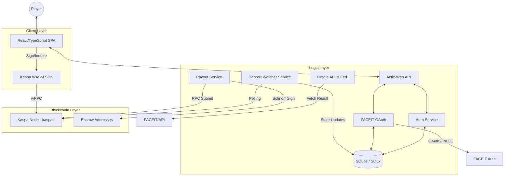

# Architecture

KaspaBattle follows a layered architecture designed to separate concerns between user interaction, business logic, and blockchain state.

## High-Level Overview

The system consists of three primary layers:

1. **Client Layer (Frontend)**: A React-based Single Page Application (SPA).
2. **Logic Layer (Backend API & Services)**: A Rust-based backend powered by Actix-Web.
3. **Blockchain Layer (Kaspa)**: The underlying DAG for value transfer and state finality.

## Component Diagram

## Data Flows

### Player Identity & FACEIT Linking

1. **User** registers/logins via **ActixAPI**.
2. **AuthService** creates a session and stores it in the **DB**.
3. **User** initiates FACEIT linking.
4. **OAuthService** redirects user to FACEIT with a **PKCE** challenge.
5. After approval, FACEIT redirects back with a code.
6. **OAuthService** exchanges code for tokens and fetches the FACEIT Profile.
7. The **DB** is updated to link the internal user to the FACEIT identity.

### Match Creation & Deposit

1. **Frontend** (authenticated) requests match creation.
2. **Backend** generates a unique keypair (using the master escrow seed) and records the address in the **DB**, associated with the player's identity.
3. **Frontend** displays the address. Player sends KAS.
4. **Watcher Service** polls the Kaspa Node via RPC. When UTXOs are found for the address, it updates the match state in the DB.

### Oracle & Payout

1. **Oracle Service** monitors the game status.
2. Once the match finishes, it fetches the winner ID from FACEIT.
3. **Payout Service** retrieves the escrow private key from the secure store.
4. It builds a transaction splitting the balance:
   - **Winner**: 95%
   - **Treasury**: 5%
5. The transaction is signed via Schnorr and submitted to the **Kaspa RPC**.

## Technology Stack

- **Frontend**: React 18, Vite, TypeScript, TailwindCSS.
- **Web3 Interface**: Kaspa WASM SDK (providing wRPC and Wallet types).
- **Backend**: Rust (Edition 2021).
  - **API Framework**: Actix-Web 4.
  - **Database**: SQLite with SQLx (async).
  - **Kaspa SDK**: `rusty-kaspa`, `kaspa-rpc-core`, `kaspa-wallet-core`.
- **Infrastructure**: Dockerized services, kaspad node (Testnet-10).

---
[Overview ←](overview.md) | [Home ↑](../README.md) | [Backend →](backend.md)
