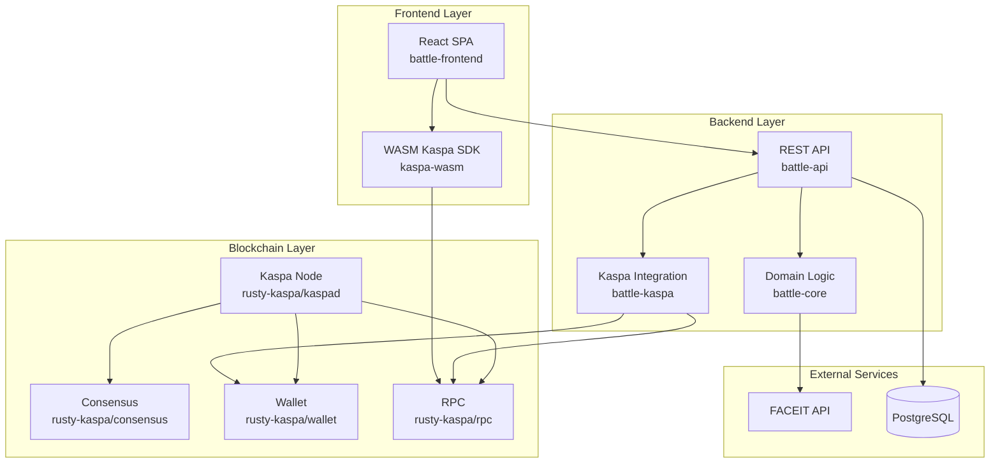

# Architecture

## High-Level Overview

KaspaBattle is a competitive gaming platform that integrates with the Kaspa blockchain for secure wagering on matches. The system uses FACEIT for player authentication and match verification, implementing multisig escrow contracts for trustless betting.

### High-Level Architecture

The system consists of three main layers:

1. **Frontend Layer**: React SPA with Kaspa WASM integration
2. **Backend Layer**: Rust-based API server with domain logic and Kaspa integration
3. **Blockchain Layer**: Kaspa node with consensus, wallet, and RPC services

#### Main Components

- **battle-frontend**: React/TypeScript application with WASM Kaspa integration
- **battle-api**: Axum-based REST API server
- **battle-core**: Shared Rust library for domain logic
- **battle-kaspa**: Kaspa blockchain integration library
- **rusty-kaspa**: Full Kaspa node implementation in Rust

#### External Dependencies

- Kaspa blockchain network
- FACEIT API for player data and match results
- PostgreSQL database for application state

For detailed module references, see [Module Reference](modules/core.md).
For data flows and use cases, see [Use Cases & Flows](flows/index.md).
