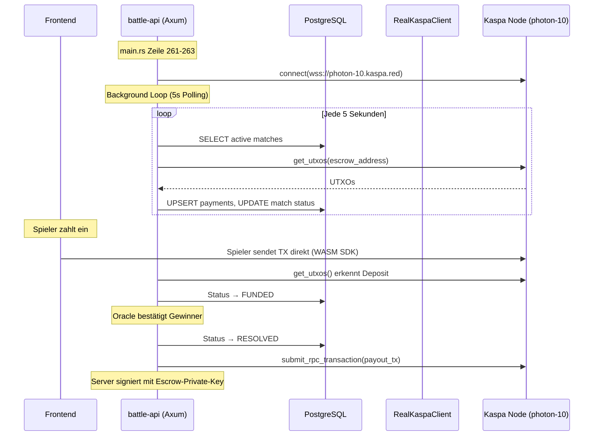
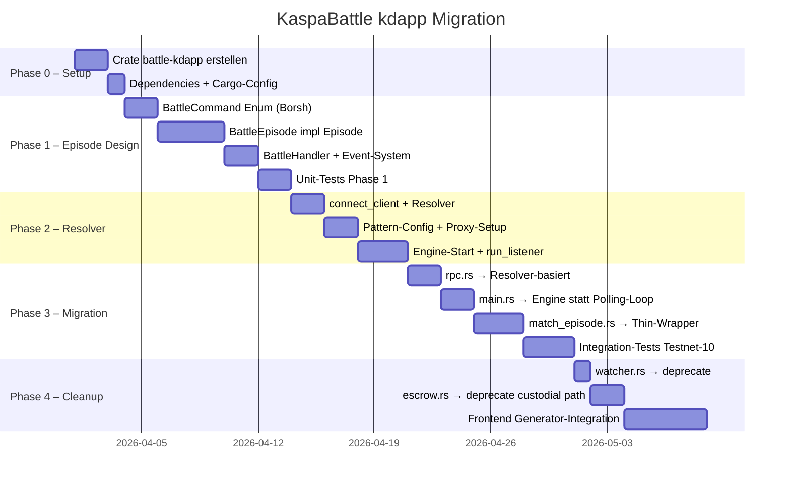

# KaspaBattle → kdapp/Resolver Migration Plan

**Version:** 1.0 | **Stand:** 25. März 2026  
**Ziel:** Umbau der zentralisierten Kaspa-Node-Anbindung (`wss://photon-10.kaspa.red`) auf das dezentrale **kdapp-Framework** mit **Kaspa Resolver**

---

## 1. Analyse: Aktuelle zentrale Node-Architektur

### 1.1 Übersicht der zentralisierten Komponenten

Die aktuelle KaspaBattle-Architektur basiert auf einem **Single Point of Failure** — ein Rust-Backend, das alle Blockchain-Interaktionen über einen einzigen wRPC-Endpunkt abwickelt:

```
┌─────────────────────────────────────────────────────────┐
│                    AKTUELL (Zentral)                      │
│                                                          │
│  Frontend ──REST──▶ battle-api ──wRPC──▶ Kaspa Node     │
│                         │                (photon-10)     │
│                         ▼                                │
│                    battle-kaspa                           │
│                    ├── rpc.rs         (wRPC Client)      │
│                    ├── escrow.rs      (Key-Custody)      │
│                    ├── payout.rs      (TX bauen+senden)  │
│                    ├── watcher.rs     (UTXO-Polling)     │
│                    └── wallet.rs      (BIP44-Keys)       │
│                         │                                │
│                         ▼                                │
│                    PostgreSQL (Off-Chain State)           │
└─────────────────────────────────────────────────────────┘
```

### 1.2 Detaillierte Analyse pro Datei

| Datei | Zeilen | Funktion | SPOF-Risiko |
|-------|--------|----------|-------------|
| [rpc.rs](file:///g:/Kaspa/VSO/KaspaBattle2/kaspabattle/battle-kaspa/src/rpc.rs) | 558 | `RealKaspaClient` – Verbindet über `KaspaRpcClient::new()` **direkt** zu `wss://photon-10.kaspa.red/kaspa/testnet-10/wrpc/borsh`. Kein Resolver, kein Fallback. Manuelles Retry mit exponentiellem Backoff. | **HOCH** – Node-Ausfall = komplett offline |
| [escrow.rs](file:///g:/Kaspa/VSO/KaspaBattle2/kaspabattle/battle-kaspa/src/escrow.rs) | 683 | `derive_escrow_address()` – SHA-256(match_id ‖ pk_a ‖ pk_b) → Secret Key → P2PK-Adresse. **Private Keys liegen zentral auf dem Server.** `EscrowService::payout_winner()` gibt aktuell Stub-TX-IDs zurück. | **KRITISCH** – Custodial Design, Server-Kompromittierung = Totalverlust |
| [payout.rs](file:///g:/Kaspa/VSO/KaspaBattle2/kaspabattle/battle-kaspa/src/payout.rs) | 619 | `PayoutService::execute_payout()` – Baut echte Kaspa-TXs: UTXO-Inputs → Schnorr-signiert → `submit_rpc_transaction()`. 95% Winner / 5% Treasury. Server besitzt Escrow-Private-Key. | **HOCH** – Zentraler Server signiert alle Payouts |
| [watcher.rs](file:///g:/Kaspa/VSO/KaspaBattle2/kaspabattle/battle-kaspa/src/watcher.rs) | 400 | `BlockchainWatcher` – Pollt `get_utxos()` für Escrow-Adressen. Per-Script UTXO-Attribution für Deposit-Erkennung. Polling-Intervall: 5s. | **MITTEL** – Funktional, aber ineffizient (keine Event-basierte Erkennung) |
| [wallet.rs](file:///g:/Kaspa/VSO/KaspaBattle2/kaspabattle/battle-kaspa/src/wallet.rs) | ~490 | `EscrowWallet` – BIP44 HD-Wallet, leitet Escrow-Adressen per Index ab. Server hält Mnemonic im Speicher. | **HOCH** – Zentraler Key-Store |
| [match_episode.rs](file:///g:/Kaspa/VSO/KaspaBattle2/kaspabattle/battle-api/src/episodes/match_episode.rs) | 627 | `MatchEpisode` – "kdapp-inspired" Episode, aber **komplett Off-Chain**: DB-basierte State Machine, Polling-Loop in `main.rs` (5s), kein on-chain State. | **MITTEL** – Name irreführend, kein echtes kdapp-Episode |

### 1.3 Zentralisierte Datenflüsse



### 1.4 Identifizierte Schwachstellen

| # | Problem | Betroffene Dateien | Schweregrad |
|---|---------|-------------------|-------------|
| S1 | **Single Node** – Kein Fallback bei Node-Ausfall | `rpc.rs` L262 | 🔴 Kritisch |
| S2 | **Custodial Escrow** – Server hält Private Keys | `escrow.rs`, `wallet.rs` | 🔴 Kritisch |
| S3 | **Off-Chain State** – Match-Status nur in DB, nicht on-chain verifizierbar | `match_state.rs`, `match_episode.rs` | 🟡 Hoch |
| S4 | **Polling statt Events** – 5s Intervall, keine TX-basierte Benachrichtigung | `watcher.rs`, `main.rs` L465-522 | 🟡 Mittel |
| S5 | **Kein Bit-Pattern-Filter** – Kein effizientes TX-Scanning | `watcher.rs` | 🟡 Mittel |
| S6 | **Server signiert Payouts** – Zentrale TX-Signierung | `payout.rs` | 🔴 Kritisch |

---

## 2. Ziel-Architektur: kdapp + Kaspa Resolver

### 2.1 Architektur-Übersicht (Dezentral)

```
┌────────────────────────────────────────────────────────────────┐
│                     ZIEL (kdapp Dezentral)                       │
│                                                                  │
│  Frontend ──▶ Generator ──TX──▶ Kaspa Netzwerk ◀── Resolver    │
│                                      │                           │
│                                      ▼                           │
│                    ┌──────────────────────────────┐              │
│                    │  Proxy (run_listener)         │              │
│                    │  Pattern-Filter auf TX-IDs   │              │
│                    │  → EngineMsg                 │              │
│                    └──────────┬───────────────────┘              │
│                               ▼                                  │
│                    ┌──────────────────────────────┐              │
│                    │  Engine                       │              │
│                    │  Episode-Lifecycle            │              │
│                    │  DAG-Reorg Handling           │              │
│                    └──────────┬───────────────────┘              │
│                               ▼                                  │
│                    ┌──────────────────────────────┐              │
│                    │  BattleEpisode               │              │
│                    │  (impl Episode Trait)        │              │
│                    │  Commands:                    │              │
│                    │   • CreateMatch              │              │
│                    │   • JoinMatch                │              │
│                    │   • ConfirmDeposit           │              │
│                    │   • ReportResult             │              │
│                    │   • InitiatePayout           │              │
│                    │   • Dispute                  │              │
│                    │   • CancelMatch              │              │
│                    └──────────────────────────────┘              │
│                                                                  │
│  REST-API (battle-api) bleibt als                               │
│  Gateway für Frontend + FACEIT OAuth + DB-Cache                 │
└────────────────────────────────────────────────────────────────┘
```

### 2.2 kdapp-Komponenten-Mapping

| Aktuelle Komponente | kdapp-Äquivalent | Verantwortlich |
|---|---|---|
| `RealKaspaClient` (manuelle Node-URL) | `connect_client(network_id, None)` → **Resolver** findet Node automatisch | kdapp `proxy.rs` |
| `BlockchainWatcher` (UTXO-Polling) | `Proxy::run_listener()` → **Pattern-Filter** auf TX-IDs | kdapp `proxy.rs` |
| `MatchEpisode` (DB-basiert) | `BattleEpisode` → `impl Episode` Trait (on-chain State) | Neu: `battle-kdapp/src/episode.rs` |
| `EscrowService` (Server-Keys) | Commands per `EpisodeMessage::SignedCommand` (Spieler signieren selbst) | kdapp `engine.rs` |
| `PayoutService` (Server-signiert) | `UnsignedCommand::InitiatePayout` + Oracle-Signatur-Validierung | Neu: `battle-kdapp/src/commands.rs` |
| `match_state.rs` (Rust-Enum) | On-chain State via Commands in der Episode | Neu: In Episode-State integriert |

### 2.3 Resolver-Integration (connect_client)

**Vorher** (rpc.rs L160-174):
```rust
// Hardcoded Node-URL, kein Fallback
let client = KaspaRpcClient::new(
    WrpcEncoding::Borsh,
    Some("wss://photon-10.kaspa.red/kaspa/testnet-10/wrpc/borsh"),
    None,       // ← KEIN Resolver
    Some(network_id),
    None,
);
```

**Nachher** (kdapp connect_client Pattern):
```rust
// Resolver findet automatisch die beste Node
pub async fn connect_client(
    network_id: NetworkId,
    rpc_url: Option<String>,
) -> Result<KaspaRpcClient, Error> {
    let url = if let Some(url) = &rpc_url { url } else { 
        &Resolver::default()
            .get_url(WrpcEncoding::Borsh, network_id)
            .await? 
    };
    let client = KaspaRpcClient::new_with_args(
        WrpcEncoding::Borsh, Some(url), None, Some(network_id), None
    )?;
    client.connect(Some(ConnectOptions {
        block_async_connect: true,
        strategy: ConnectStrategy::Fallback,
        connect_timeout: Some(Duration::from_secs(5)),
        ..Default::default()
    })).await?;
    Ok(client)
}
```

---

## 3. Implementierungsplan

### Phase 0: Vorbereitung & Dependencies

#### 3.0.1 Neues Crate `battle-kdapp` erstellen

```
kaspabattle/
├── battle-api/        (bestehend – anpassen)
├── battle-core/       (bestehend – minimal anpassen)
├── battle-kaspa/      (bestehend – schrittweise ersetzen)
├── battle-kdapp/      ← NEU
│   ├── Cargo.toml
│   └── src/
│       ├── lib.rs
│       ├── episode.rs         # BattleEpisode: impl Episode Trait
│       ├── commands.rs        # BattleCommand Enum (Borsh)
│       ├── handler.rs         # EpisodeEventHandler
│       ├── proxy_config.rs    # Resolver + Pattern-Config
│       └── oracle_bridge.rs   # FACEIT-Result → On-Chain Command
```

#### 3.0.2 Cargo-Dependencies

```toml
# battle-kdapp/Cargo.toml
[package]
name = "battle-kdapp"
version = "0.1.0"
edition = "2021"

[dependencies]
battle-core = { path = "../battle-core" }
kdapp = { git = "https://github.com/michaelsutton/kdapp" }
kaspa-addresses = { git = "https://github.com/kaspanet/rusty-kaspa" }
kaspa-wrpc-client = "0.15"
kaspa-rpc-core = "0.15"
kaspa-consensus-core = "0.15"
kaspa-hashes = "0.15"
borsh = "1"
secp256k1 = { version = "0.29", features = ["global-context", "rand-std"] }
sha2 = "0.10"
tokio = { version = "1", features = ["full"] }
tracing = "0.1"
serde = { version = "1", features = ["derive"] }
uuid = { version = "1", features = ["v4"] }
```

#### 3.0.3 Workspace anpassen

```diff
# kaspabattle/Cargo.toml
 [workspace]
-members = ["battle-core", "battle-kaspa", "battle-api"]
+members = ["battle-core", "battle-kaspa", "battle-kdapp", "battle-api"]
 resolver = "2"
```

---

### Phase 1: On-Chain Episode Design (Kern-Migration)

#### 3.1.1 BattleCommand — On-Chain Command-Typ

```rust
// battle-kdapp/src/commands.rs
use borsh::{BorshSerialize, BorshDeserialize};

#[derive(BorshSerialize, BorshDeserialize, Debug, Clone)]
pub enum BattleCommand {
    /// Spieler A erstellt ein Match mit Wager-Betrag
    CreateMatch {
        wager_sompi: u64,
        game_type: GameType,
    },
    /// Spieler B tritt einem Match bei
    JoinMatch,
    /// Deposit-Bestätigung (Spieler sendet nach On-Chain-Einzahlung)
    ConfirmDeposit {
        tx_hash: [u8; 32],
        amount_sompi: u64,
    },
    /// Oracle meldet Spielergebnis
    ReportResult {
        winner_pubkey: PubKey,
        faceit_match_id: String,
        score_a: u8,
        score_b: u8,
    },
    /// Gewinner triggert Auszahlung
    InitiatePayout {
        winner_address: String,
    },
    /// Spieler beantragt Dispute
    Dispute {
        reason: String,
    },
    /// Match abbrechen (vor Lock)
    CancelMatch {
        reason: String,
    },
}

#[derive(BorshSerialize, BorshDeserialize, Debug, Clone)]
pub enum GameType {
    CS2,
    // Erweiterbar für weitere Spiele
}

/// Rollback-Daten für DAG-Reorgs
#[derive(BorshSerialize, BorshDeserialize, Debug, Clone)]
pub enum BattleRollback {
    UndoCreateMatch,
    UndoJoinMatch { previous_state: MatchPhase },
    UndoConfirmDeposit { player: PlayerSide, amount: u64 },
    UndoReportResult,
    UndoInitiatePayout,
    UndoDispute,
    UndoCancelMatch { previous_state: MatchPhase },
}

#[derive(BorshSerialize, BorshDeserialize, Debug, Clone)]
pub enum PlayerSide { A, B }

#[derive(BorshSerialize, BorshDeserialize, Debug, Clone)]
pub enum MatchPhase {
    WaitingForOpponent,
    WaitingForDeposits { a_deposited: bool, b_deposited: bool },
    Locked,
    Resolved { winner: PubKey },
    Disputed { reason: String, by: PubKey },
    Cancelled { reason: String },
    Completed,
}
```

#### 3.1.2 BattleEpisode — Episode Trait Implementation

```rust
// battle-kdapp/src/episode.rs
use kdapp::episode::{Episode, EpisodeError, PayloadMetadata};
use kdapp::pki::PubKey;
use crate::commands::{BattleCommand, BattleRollback, MatchPhase, PlayerSide};

#[derive(Debug, Clone)]
pub struct BattleEpisode {
    pub participants: Vec<PubKey>,    // [player_a, player_b]
    pub phase: MatchPhase,
    pub wager_sompi: u64,
    pub deposits: [u64; 2],           // [player_a_deposit, player_b_deposit]
    pub winner: Option<PubKey>,
    pub created_daa: u64,
    pub oracle_pubkey: Option<PubKey>, // Autorisierter Oracle
}

#[derive(Debug, thiserror::Error)]
pub enum BattleError {
    #[error("Not a participant")]
    NotParticipant,
    #[error("Invalid phase transition: {from} → {action}")]
    InvalidTransition { from: String, action: String },
    #[error("Insufficient deposit: need {required}, got {got}")]
    InsufficientDeposit { required: u64, got: u64 },
    #[error("Unauthorized: only oracle can report results")]
    UnauthorizedOracle,
    #[error("Match timeout exceeded")]
    Timeout,
    #[error("Already deposited")]
    AlreadyDeposited,
}

impl Episode for BattleEpisode {
    type Command = BattleCommand;
    type CommandRollback = BattleRollback;
    type CommandError = BattleError;

    fn initialize(participants: Vec<PubKey>, metadata: &PayloadMetadata) -> Self {
        BattleEpisode {
            participants,
            phase: MatchPhase::WaitingForOpponent,
            wager_sompi: 0,
            deposits: [0, 0],
            winner: None,
            created_daa: metadata.accepting_daa,
            oracle_pubkey: None,
        }
    }

    fn execute(
        &mut self,
        cmd: &Self::Command,
        authorization: Option<PubKey>,
        metadata: &PayloadMetadata,
    ) -> Result<Self::CommandRollback, EpisodeError<Self::CommandError>> {
        match cmd {
            BattleCommand::CreateMatch { wager_sompi, .. } => {
                // Nur im initialen Zustand
                self.wager_sompi = *wager_sompi;
                self.phase = MatchPhase::WaitingForOpponent;
                Ok(BattleRollback::UndoCreateMatch)
            }

            BattleCommand::JoinMatch => {
                if !matches!(self.phase, MatchPhase::WaitingForOpponent) {
                    return Err(EpisodeError::App(BattleError::InvalidTransition {
                        from: format!("{:?}", self.phase),
                        action: "JoinMatch".into(),
                    }));
                }
                let prev = self.phase.clone();
                self.phase = MatchPhase::WaitingForDeposits {
                    a_deposited: false,
                    b_deposited: false,
                };
                Ok(BattleRollback::UndoJoinMatch { previous_state: prev })
            }

            BattleCommand::ConfirmDeposit { amount_sompi, .. } => {
                let auth = authorization.ok_or(
                    EpisodeError::App(BattleError::NotParticipant)
                )?;
                let side = self.identify_player(&auth)?;
                let idx = match side { PlayerSide::A => 0, PlayerSide::B => 1 };

                if self.deposits[idx] >= self.wager_sompi {
                    return Err(EpisodeError::App(BattleError::AlreadyDeposited));
                }

                self.deposits[idx] += amount_sompi;

                // Beide Deposits vollständig → Lock
                if self.deposits[0] >= self.wager_sompi
                    && self.deposits[1] >= self.wager_sompi
                {
                    self.phase = MatchPhase::Locked;
                }

                Ok(BattleRollback::UndoConfirmDeposit {
                    player: side,
                    amount: *amount_sompi,
                })
            }

            BattleCommand::ReportResult { winner_pubkey, .. } => {
                // Nur Oracle darf Ergebnis melden (signiert)
                let auth = authorization.ok_or(
                    EpisodeError::App(BattleError::UnauthorizedOracle)
                )?;
                if Some(&auth) != self.oracle_pubkey.as_ref() {
                    return Err(EpisodeError::App(BattleError::UnauthorizedOracle));
                }
                if !matches!(self.phase, MatchPhase::Locked) {
                    return Err(EpisodeError::App(BattleError::InvalidTransition {
                        from: format!("{:?}", self.phase),
                        action: "ReportResult".into(),
                    }));
                }
                self.winner = Some(winner_pubkey.clone());
                self.phase = MatchPhase::Resolved {
                    winner: winner_pubkey.clone(),
                };
                Ok(BattleRollback::UndoReportResult)
            }

            BattleCommand::InitiatePayout { .. } => {
                if !matches!(self.phase, MatchPhase::Resolved { .. }) {
                    return Err(EpisodeError::App(BattleError::InvalidTransition {
                        from: format!("{:?}", self.phase),
                        action: "InitiatePayout".into(),
                    }));
                }
                self.phase = MatchPhase::Completed;
                Ok(BattleRollback::UndoInitiatePayout)
            }

            BattleCommand::Dispute { reason } => {
                if !matches!(self.phase, MatchPhase::Resolved { .. }) {
                    return Err(EpisodeError::App(BattleError::InvalidTransition {
                        from: format!("{:?}", self.phase),
                        action: "Dispute".into(),
                    }));
                }
                let auth = authorization.ok_or(
                    EpisodeError::App(BattleError::NotParticipant)
                )?;
                self.phase = MatchPhase::Disputed {
                    reason: reason.clone(),
                    by: auth,
                };
                Ok(BattleRollback::UndoDispute)
            }

            BattleCommand::CancelMatch { reason } => {
                match &self.phase {
                    MatchPhase::WaitingForOpponent
                    | MatchPhase::WaitingForDeposits { .. } => {
                        let prev = self.phase.clone();
                        self.phase = MatchPhase::Cancelled {
                            reason: reason.clone(),
                        };
                        Ok(BattleRollback::UndoCancelMatch { previous_state: prev })
                    }
                    _ => Err(EpisodeError::App(BattleError::InvalidTransition {
                        from: format!("{:?}", self.phase),
                        action: "CancelMatch".into(),
                    })),
                }
            }
        }
    }

    fn rollback(&mut self, rollback: Self::CommandRollback) -> bool {
        match rollback {
            BattleRollback::UndoCreateMatch => {
                self.wager_sompi = 0;
                self.phase = MatchPhase::WaitingForOpponent;
                true
            }
            BattleRollback::UndoJoinMatch { previous_state } => {
                self.phase = previous_state;
                true
            }
            BattleRollback::UndoConfirmDeposit { player, amount } => {
                let idx = match player { PlayerSide::A => 0, PlayerSide::B => 1 };
                self.deposits[idx] = self.deposits[idx].saturating_sub(amount);
                // Revert phase if was Locked
                if matches!(self.phase, MatchPhase::Locked) {
                    self.phase = MatchPhase::WaitingForDeposits {
                        a_deposited: self.deposits[0] >= self.wager_sompi,
                        b_deposited: self.deposits[1] >= self.wager_sompi,
                    };
                }
                true
            }
            BattleRollback::UndoReportResult => {
                self.winner = None;
                self.phase = MatchPhase::Locked;
                true
            }
            BattleRollback::UndoInitiatePayout => {
                if let Some(winner) = &self.winner {
                    self.phase = MatchPhase::Resolved { winner: winner.clone() };
                }
                true
            }
            BattleRollback::UndoDispute => {
                if let Some(winner) = &self.winner {
                    self.phase = MatchPhase::Resolved { winner: winner.clone() };
                }
                true
            }
            BattleRollback::UndoCancelMatch { previous_state } => {
                self.phase = previous_state;
                true
            }
        }
    }
}

impl BattleEpisode {
    fn identify_player(&self, pubkey: &PubKey) -> Result<PlayerSide, EpisodeError<BattleError>> {
        if self.participants.get(0) == Some(pubkey) {
            Ok(PlayerSide::A)
        } else if self.participants.get(1) == Some(pubkey) {
            Ok(PlayerSide::B)
        } else {
            Err(EpisodeError::App(BattleError::NotParticipant))
        }
    }
}
```

#### 3.1.3 Event-Handler

```rust
// battle-kdapp/src/handler.rs
use kdapp::episode::EpisodeEventHandler;
use crate::episode::BattleEpisode;
use crate::commands::BattleCommand;

pub struct BattleHandler {
    pub db_pool: PgPool, // Optional: DB-Cache für Frontend
}

impl EpisodeEventHandler<BattleEpisode> for BattleHandler {
    fn on_command(
        &self,
        episode_id: &EpisodeId,
        command: &BattleCommand,
        result: &Result<BattleRollback, EpisodeError<BattleError>>,
    ) {
        match (command, result) {
            (BattleCommand::ConfirmDeposit { .. }, Ok(_)) => {
                // Optional: Update DB-Cache für Frontend
                tracing::info!("Deposit confirmed on-chain for episode {}", episode_id);
            }
            (BattleCommand::ReportResult { winner_pubkey, .. }, Ok(_)) => {
                tracing::info!("Match resolved on-chain: winner {:?}", winner_pubkey);
                // Trigger Payout-TX-Build
            }
            _ => {}
        }
    }
}
```

---

### Phase 2: Resolver + Proxy-Integration

#### 3.2.1 Proxy-Konfiguration (proxy_config.rs)

```rust
// battle-kdapp/src/proxy_config.rs
use kdapp::generator::{PatternType, PrefixType};
use kdapp::proxy::connect_client;
use kaspa_consensus_core::network::NetworkId;

/// KaspaBattle-spezifisches Bit-Pattern für TX-ID-Filterung.
/// 10 Bits → Trefferrate ~1:1024
pub const BATTLE_PATTERN: PatternType = [
    (0, 1), (1, 0), (2, 1), (3, 1),  // 0b1011 = "B" für Battle
    (4, 0), (5, 1), (6, 0), (7, 1),  // 0b0101
    (8, 1), (9, 0),                    // Extra-Bits für Eindeutigkeit
];

/// 4-Byte Payload-Prefix zur Engine-Identifikation
pub const BATTLE_PREFIX: PrefixType = 0x4B425432; // "KBT2" in Hex

/// Verbindung via Resolver aufbauen
pub async fn connect_battle_node(
    network_id: NetworkId,
    custom_url: Option<String>,
) -> Result<KaspaRpcClient, anyhow::Error> {
    let client = connect_client(network_id, custom_url).await?;
    Ok(client)
}
```

#### 3.2.2 Engine-Start und Listener

```rust
// battle-kdapp/src/lib.rs
use kdapp::engine::Engine;
use kdapp::proxy::run_listener;

pub async fn start_battle_engine(
    network_id: NetworkId,
    rpc_url: Option<String>,
) -> Result<(), anyhow::Error> {
    // 1. Verbindung via Resolver
    let kaspad = connect_client(network_id, rpc_url).await?;

    // 2. Engine erstellen
    let handler = BattleHandler { /* ... */ };
    let engine = Engine::<BattleEpisode>::new(
        BATTLE_PREFIX,
        handler,
    );

    // 3. Listener starten (filtert TXs per Pattern)
    run_listener(kaspad, engine, BATTLE_PATTERN).await?;

    Ok(())
}
```

---

### Phase 3: Migration der bestehenden Dateien

#### 3.3.1 `rpc.rs` — Anpassungen

| Änderung | Beschreibung |
|----------|-------------|
| `RealKaspaClient::new()` ersetzen | Durch `connect_client(network_id, rpc_url)` mit Resolver |
| `ensure_connected()` vereinfachen | `ConnectStrategy::Fallback` im kdapp-Client übernimmt Reconnect |
| `KaspaRpc` Trait erweitern | Methode `get_virtual_chain_from_block()` für Proxy-Polling hinzufügen |

**Konkrete Code-Änderung in `rpc.rs`:**

```diff
 impl RealKaspaClient {
     pub async fn new(node_url: &str, network: &str) -> Result<Self, KaspaError> {
-        let client = kaspa_wrpc_client::KaspaRpcClient::new(
-            WrpcEncoding::Borsh,
-            Some(node_url),
-            None, // no resolver
-            Some(network_id),
-            None,
-        )?;
+        // Phase 3: Resolver-basierte Verbindung
+        let resolved_url = if node_url.is_empty() {
+            Resolver::default()
+                .get_url(WrpcEncoding::Borsh, network_id)
+                .await
+                .map_err(|e| KaspaError::ConnectionFailed(format!("Resolver failed: {}", e)))?
+        } else {
+            node_url.to_string()
+        };
+        let client = kaspa_wrpc_client::KaspaRpcClient::new_with_args(
+            WrpcEncoding::Borsh,
+            Some(&resolved_url),
+            None,
+            Some(network_id),
+            None,
+        )?;
```

#### 3.3.2 `watcher.rs` → Pattern-basierter Listener

Der `BlockchainWatcher` wird durch den kdapp `Proxy::run_listener()` abgelöst:

| Alt (watcher.rs) | Neu (kdapp Proxy) |
|---|---|
| `check_escrow_balance()` – pollt `get_utxos()` | Nicht mehr nötig – Pattern-Filter erkennt TX automatisch |
| `evaluate_deposits()` – Heuristik | `BattleEpisode::execute(ConfirmDeposit)` – deterministisch on-chain |
| 5s Polling-Intervall | 1s Polling via `get_virtual_chain_from_block()` |
| Per-Script UTXO-Attribution | Signierte Commands → Sender ist kryptographisch verifiziert |

#### 3.3.3 `escrow.rs` → Nicht mehr benötigt (langfristig)

**Kurzfristig (Phase 3):** `EscrowService` bleibt als Fallback für Deposit-Validierung.  
**Langfristig (Phase 4):** Escrow-Logik wandert vollständig in die `BattleEpisode`. Private Keys werden nicht mehr serverseitig gehalten — Spieler signieren ihre Deposits selbst.

#### 3.3.4 `payout.rs` → On-Chain Payout via Commands

**Kurzfristig:** PayoutService nutzt Resolver statt hardcoded Node-URL.  
**Langfristig:** Payout wird als `BattleCommand::InitiatePayout` on-chain getriggert. Ein berechtigter Oracle signiert den Payout-Command, die Episode validiert die Berechtigung und löst die Auszahlung aus.

#### 3.3.5 `main.rs` — Startup-Anpassungen

```diff
 // main.rs — Kaspa-Verbindung
-let kaspa_node_url = std::env::var("KASPA_NODE_URL")
-    .unwrap_or_else(|_| "wss://photon-10.kaspa.red/kaspa/testnet-10/wrpc/borsh".to_string());
+let kaspa_node_url = std::env::var("KASPA_NODE_URL").ok(); // Optional — Resolver findet Node
+let kaspa_network_id = parse_network_id(&kaspa_network);

-let kaspa_rpc = match RealKaspaClient::new(&kaspa_node_url, &kaspa_network).await {
+let kaspa_rpc = match RealKaspaClient::new_with_resolver(
+    kaspa_node_url.as_deref(),
+    kaspa_network_id,
+).await {

 // Neuer Background-Task: kdapp Engine statt handgeschriebener Polling-Loop
-tokio::spawn({ ... /* 5s polling loop */ ... });
+tokio::spawn({
+    let network_id = kaspa_network_id;
+    let rpc_url = kaspa_node_url.clone();
+    async move {
+        if let Err(e) = battle_kdapp::start_battle_engine(network_id, rpc_url).await {
+            tracing::error!("Battle engine failed: {}", e);
+        }
+    }
+});
```

#### 3.3.6 `match_episode.rs` — Schrittweise Migration

| Phase | Aktion |
|-------|--------|
| **Phase 3a** | `MatchEpisode::execute()` sendet Commands via `TransactionGenerator` on-chain statt DB direkt |
| **Phase 3b** | `BattleHandler::on_command()` schreibt State-Updates in DB (für Frontend-Kompatibilität) |
| **Phase 3c** | `MatchEpisode` wird Thin-Wrapper um `BattleEpisode`: leitet API-Calls auf on-chain Commands um |
| **Phase 4** | `match_episode.rs` wird obsolet, Frontend spricht direkt mit kdapp/Generator |

---

### Phase 4: Frontend-Anpassungen (Optional / Langfristig)

#### 3.4.1 TX-Senden via Generator

```typescript
// Frontend: Deposit als on-chain Command senden
const generator = new TransactionGenerator(keypair, BATTLE_PATTERN, BATTLE_PREFIX);
const cmd = EpisodeMessage.newSignedCommand(
    episodeId,
    { ConfirmDeposit: { tx_hash: depositTxHash, amount_sompi: wager } },
    secretKey,
    publicKey
);
const tx = generator.buildCommandTransaction(utxo, recipient, cmd, fee);
await kaspad.submitTransaction(tx);
```

#### 3.4.2 Kompatibilitäts-Layer

Während der Migration liefert das REST-API weiterhin Match-Status per DB-Queries.  
Der `BattleHandler` synchronisiert on-chain State → DB.

---

### Phase 5: Testplan & Verifizierung

#### 3.5.1 Bestehende Tests validieren

```bash
# Alle bestehenden Tests müssen weiterhin grün sein
cd kaspabattle
cargo test --workspace
```

#### 3.5.2 Neue Unit-Tests für BattleEpisode

```bash
# Tests im neuen Crate
cd kaspabattle/battle-kdapp
cargo test
```

| Test | Beschreibung |
|------|-------------|
| `test_episode_lifecycle_happy_path` | Create → Join → Deposit A → Deposit B → Lock → ReportResult → Payout |
| `test_episode_rollback` | DAG-Reorg: Rollback nach ConfirmDeposit |
| `test_episode_invalid_transitions` | Verify alle ungültigen State-Transitions |
| `test_episode_unauthorized_oracle` | Nur Oracle-PubKey darf ReportResult senden |
| `test_episode_dispute_blocks_payout` | Dispute nach Resolved blockiert InitiatePayout |
| `test_resolver_connect` | `connect_client(testnet-10, None)` findet Node via Resolver |
| `test_pattern_match` | TX-IDs mit korrektem Bit-Pattern werden erkannt |

#### 3.5.3 Integration-Tests auf Testnet-10

```bash
# Testnet-10 Integration
KASPA_NETWORK=testnet-10 cargo test --package battle-kdapp -- --ignored integration
```

| Test | Beschreibung |
|------|-------------|
| `test_resolver_real_connection` | Verbindung über Resolver zu Testnet-10 |
| `test_submit_command_tx` | Command-TX mit Pattern-Mining senden |
| `test_listener_receives_command` | Proxy empfängt eigene TX per Pattern-Filter |
| `test_full_match_e2e` | Vollständiger Match-Lifecycle on-chain |

---

## Migrations-Reihenfolge (Empfehlung)



Geschätzter Gesamtaufwand: **~5 Wochen** (1 Entwickler, Vollzeit)

---

## Risiken & Mitigationen

| Risiko | Mitigation |
|--------|-----------|
| kdapp ist Alpha, API-Breaks möglich | Version pinnen, Changelog beobachten, Wrapper-Abstraktion |
| Pattern-Mining CPU-intensiv | Fallback auf niedrigeres Bit-Pattern (8 statt 10 Bits) |
| Testnet-10 Node-Instabilität | Resolver Fallback-Strategy, lokalen Node als Backup betreiben |
| DB-Cache Konsistenz mit on-chain State | `BattleHandler` als Single-Source-of-Truth-Bridge, Reconciliation-Job |
| FACEIT-OAuth bleibt Off-Chain | Akzeptabel: Gaming-Plattform-Integration ist per Definition Off-Chain |

---

## Zusammenfassung der Änderungen

| Bereich | Vorher | Nachher |
|---------|--------|---------|
| **Node-Verbindung** | Hardcoded `wss://photon-10.kaspa.red` | `Resolver::default()` findet automatisch |
| **TX-Erkennung** | UTXO-Polling (5s) | Pattern-Filter auf TX-IDs (1s) |
| **Match-State** | Nur in PostgreSQL | On-chain via Episode Commands |
| **Key-Custody** | Server hält alle Escrow-Keys | Spieler signieren selbst (PKI) |
| **Payout** | Server-signierte TX | Oracle-signiertes Command + Episode-Validierung |
| **DAG-Reorgs** | Nicht behandelt | Engine-Rollback via `Episode::rollback()` |
| **Fallback** | Keiner | `ConnectStrategy::Fallback` + Resolver |
